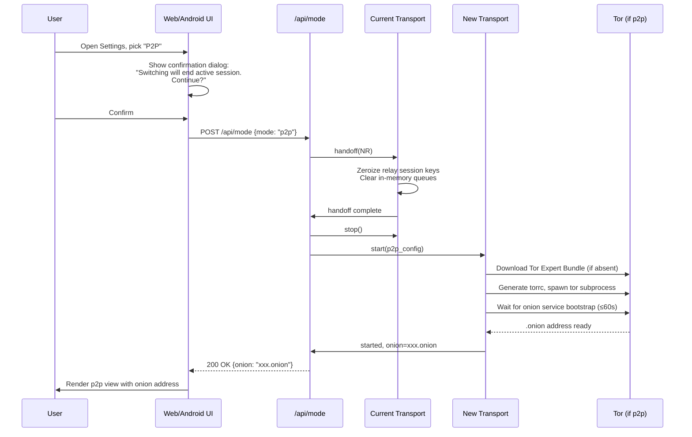

# AnonyMus — Unified Branch Merge Plan

**Repository:** [`aryansinghnagar/AnonyMus`](https://github.com/aryansinghnagar/AnonyMus)
**Source branches:** `main` (centralized client-server relay) · `origin/p2p` (decentralized Tor onion peer-to-peer)
**Target branch:** `main` (the unified codebase ships here)
**Common ancestor commit:** `708df82` ("security: purge PII and local path dependencies")
**Divergence:** 12 commits on `main`, 14 commits on `p2p` since the common ancestor
**Strategy:** Monorepo + Runtime Feature Flags · In-App Mode Toggle · Reconcile-and-Abstract Conflict Resolution · Zero-Downtime `--no-ff` Merge
**Plan depth:** Phased roadmap, ~3 weeks, contributor-facing setup guide
**Status:** Draft v1 — awaits maintainer sign-off on the open questions in §12

---

## 1. Executive Summary & Mandate

AnonyMus today exists as two parallel branches that share a common cryptographic DNA but have drifted apart in architecture, deployment model, and feature surface. The `main` branch is a zero-knowledge Flask-SocketIO relay server with a web client and a native Android (Kotlin/Jetpack Compose) client; it ships with Docker, PostgreSQL, Redis, mDNS discovery, biometric lock, and cert pinning. The `p2p` branch is a decentralized Tor-onion peer-to-peer node packaged as a disguised Windows "Network Diagnostics" utility, with an embedded Tor Expert Bundle, AES-GCM encrypted local database, contact directory model, and a secure-wiping Inno Setup uninstaller. Both branches inherited the same ECDH-P256 + HKDF-SHA256 ratchet and the same Flask + bcrypt + eventlet stack from their common ancestor, which gives us a stable cryptographic baseline to reconcile around.

The mandate of this plan is to merge both branches into a single unified codebase, hosted on `main`, where any user — at runtime, from inside the application UI — can choose whether to operate in client-server relay mode or in peer-to-peer Tor onion mode, and switch between them without reinstalling the app. The merge must (a) preserve every feature present on either branch, (b) leave zero residual git conflicts, (c) carry over every privacy, security, and accessibility guarantee verbatim, and (d) keep `main` deployable at every commit so the merge can be aborted at any phase without downtime. The user has explicitly directed that **Privacy, Security, and Accessibility are inviolable — they must never be compromised to expedite the merge**.

To achieve this we adopt a **monorepo + runtime feature flags** structure, a **reconcile-and-abstract** conflict policy (both implementations of a divergent feature are refactored behind a shared interface, with mode-specific adapters), and a **three-week phased roadmap** with verifiable acceptance criteria at the end of each week. The in-app mode toggle is the primary user-facing surface, with environment variables and CLI flags retained as power-user escape hatches. The merge is executed on a long-lived `unified` working branch, opened as a single PR against `main`, and landed with `git merge --no-ff` so both branch histories are preserved and the merge commit itself is revertible in one step if a regression is detected post-merge.

---

## 2. Current State: Branch Inventory & Divergence Analysis

### 2.1 What lives on `main` (client-server relay)

The `main` branch is the centralized architecture. Its top-level layout is:

```
AnonyMus/
├── server.py                  # 714 LOC — Flask-SocketIO relay (eventlet, mDNS, SSL, rate limit)
├── database.py                # SQLite (WAL) + PostgreSQL dual backend, bcrypt auth
├── requirements.txt           # Flask, Flask-SocketIO, cryptography, bcrypt, eventlet, psycopg2, Flask-Limiter
├── .env.example
├── Dockerfile                 # python:3.11-slim, gunicorn + eventlet worker
├── docker-compose.yml         # Flask + PostgreSQL + Redis
├── static/                    # Web client: crypto.js, chat.js, login.js, style.css, logo.png
├── templates/                 # chat.html, login.html
├── tests/                     # test_crypto.js, test_database.py, test_integration.py
├── AnonyMus_android/          # Kotlin/Jetpack Compose client (Tink, biometric, FLAG_SECURE, cert pinning)
├── README.md, SETUP.md, FEATURES.md
└── .github/workflows/test.yml
```

Notable `main`-branch features that must survive the merge:
- **Zero-knowledge relay**: the server holds ephemeral in-memory queues keyed by UUID; messages are deleted after the recipient pulls them. The SQLite/Postgres backend stores only `users(username, password_hash)` for auth.
- **HKDF-SHA256 symmetric ratchet**: every message advances the chain key, producing a single-use message key that is zero-filled after use.
- **AES-256-GCM with AAD binding**: ciphertext integrity is bound to the sorted cryptographic fingerprints of participants (Safety Number) plus the protocol version.
- **mDNS service advertisement** at `_anonymus._tcp.local.` for zero-config LAN discovery.
- **Log redaction filter** that strips Base64 key material, UUIDs, and authorization headers from all server logs.
- **Strict security headers** (HSTS, X-Content-Type-Options, X-Frame-Options DENY, CSP, Referrer-Policy, Permissions-Policy).
- **Rate limiting** via Flask-Limiter with Redis backend when configured, in-memory otherwise.
- **Self-signed SSL certificate generation** for direct HTTPS deployment.
- **Android client** with Google Tink for crypto, BiometricPrompt, `FLAG_SECURE`, TOFU cert pinning, NSD discovery, and a calculator panic view.

### 2.2 What lives on `origin/p2p` (decentralized Tor onion)

The `p2p` branch is the decentralized architecture. It deliberately removed the client-server code (`a61b71b: "refactor: segregate builds and remove client-server components from P2P branch"`), so its top-level layout is leaner:

```
AnonyMus/
├── app_p2p/                   # P2P application as a Python subpackage
│   ├── server.py              # 574 LOC — local node + public /p2p/* Tor endpoints
│   ├── database.py            # local_node.db with AES-GCM encrypted secrets, contacts, messages
│   ├── tor_manager.py         # Tor Expert Bundle auto-download, torrc, onion service bootstrap
│   ├── static/                # crypto.js (chunked toBase64), chat.js (contact directory), login.js, style.css
│   ├── templates/             # chat.html (sidebar with contact list), login.html
│   └── tests/                 # test_crypto.js, test_database.py, test_integration.py
├── launcher.py                # Tkinter GUI disguised as "Windows Network Diagnostics & Adapter Utility"
├── build.py                   # PyInstaller + Inno Setup automation, Authenticode self-signing
├── setup.iss                  # Inno Setup script with secure-wiping uninstaller
├── requirements.txt           # same as main + requests[socks]==2.31.0 for Tor SOCKS5
├── .env.example
├── README.md, SETUP.md, FEATURES.md
└── .github/workflows/test.yml
```

Notable `p2p`-branch features that must survive the merge:
- **Embedded Tor Expert Bundle** auto-downloaded (v15.0.16), integrity-verified, extracted to `bin/tor/`, with a generated `torrc` and onion service config.
- **Onion hidden service** exposing local Flask endpoints over Tor (port 80 → dynamically assigned local port).
- **Outbound SOCKS5 routing** through `127.0.0.1:9050` so no peer ever sees another peer's IP.
- **Localhost-bound security boundary**: a `before_request` hook rejects any request whose `Host` header is not `localhost`/`127.0.0.1`/`[::1]` unless the path starts with `/p2p/`, preventing Tor users from reaching the local admin panel.
- **AES-256-GCM local DB encryption**: master password → PBKDF2-HMAC-SHA256 (10 000 iterations) → DB key, used to encrypt shared secrets and peer public keys at rest.
- **Contact directory model**: each peer has a nickname, onion address, peer public key, and stored (encrypted) shared secret. Multi-contact UI in the sidebar.
- **Disguised Tkinter launcher** that looks like a Windows network diagnostic tool; dynamic port assignment to evade static-port detection.
- **Inno Setup secure-wiping uninstaller** that prompts to delete `bin/`, `local_node.db`, and config files, leaving no trace.
- **P2P-specific crypto.js improvement**: chunked `toBase64` (0x8000-byte chunks) that avoids call-stack overflow on larger payloads — strictly better than the `main` version and must be adopted as canonical.

### 2.3 What they share (reconciliation foundation)

Both branches inherit from `708df82` and retain:
- **Identical ECDH-P256 key generation** in `crypto.js` (`generateKeyPair`, `exportPublicKey`, `importPublicKey`).
- **Identical HKDF-SHA256 ratchet** semantics (chain key advance → ephemeral message key).
- **Identical AES-256-GCM with 12-byte CSPRNG IV**.
- **Identical Flask-SocketIO + eventlet + Flask-Limiter + bcrypt** stack on the server side.
- **Identical security-headers `after_request` hook** (HSTS, X-Frame-Options DENY, CSP, etc.).
- **Identical `redact_sensitive` log filter** pattern (the p2p branch dropped it during segregation — must be restored in unified tree).
- **Identical "Workspace Mail" / calculator-panic camouflage UX** in the web client.

This shared foundation is what makes a reconcile-and-abstract strategy viable rather than a full rewrite.

### 2.4 Where they diverge (conflict surface)

| Dimension | `main` | `p2p` | Reconciliation path |
|---|---|---|---|
| Server entrypoint | `server.py` (root) | `app_p2p/server.py` | Both move to `/transports/relay/` and `/transports/p2p/` respectively |
| Database module | `database.py` (users.db, sqlite+postgres) | `app_p2p/database.py` (local_node.db, AES-GCM) | Both kept; abstracted behind `DatabaseProvider` interface |
| Web `crypto.js` | Non-chunked `toBase64` | Chunked `toBase64` (0x8000) | **P2P version wins** (strictly better) |
| Web `chat.js` | Queue-based session model | Contact-directory model | Unified file with mode-aware code paths |
| `chat.html` | Setup/join/chat views | Sidebar + welcome/pending/chat views | Conditional render via `data-mode` attribute |
| `requirements.txt` | Missing `requests[socks]` | Has `requests[socks]==2.31.0` | Union of both |
| `.env.example` | Has `DISABLE_SSL` | Lacks `DISABLE_SSL` | Union; add `ANONYMUS_MODE` |
| Tests | `tests/` | `app_p2p/tests/` | Both kept; renamed to `tests/relay/` and `tests/p2p/` |
| Packaging | Dockerfile + compose | launcher.py + build.py + setup.iss | All four kept; Docker gains a p2p variant |
| Android | Full Kotlin client | Absent (was removed in `a61b71b`) | Kept verbatim from `main`; gains mode selector |
| Tor integration | None | `tor_manager.py` | Moves to `/transports/p2p/tor_manager.py` |
| mDNS | `_anonymus._tcp.local.` | None | Kept; only active in relay mode |
| Log redaction | Present | Dropped | Restored; applied to both modes |
| Launcher | None | Disguised Tkinter | Upgraded to support mode selection |

---

## 3. Target Architecture: Unified Monorepo + Feature Flags

### 3.1 Proposed directory tree

```
AnonyMus/                                # unified repo, lives on `main`
├── core/                                # shared, mode-agnostic primitives
│   ├── __init__.py
│   ├── crypto.py                        # unified CryptoService (ECDH, HKDF, AES-GCM, PBKDF2)
│   ├── identity.py                      # anonymous credential / zero-knowledge auth helpers
│   ├── session.py                       # ratchet state, safety numbers, session lifecycle
│   ├── logging.py                       # redacting filter, log sanitation (restored from main)
│   ├── security_headers.py              # shared Flask after_request hook
│   └── interfaces.py                    # TransportProvider, DatabaseProvider ABCs
│
├── transports/
│   ├── relay/                           # formerly server.py + database.py (main branch)
│   │   ├── __init__.py
│   │   ├── server.py                    # Flask-SocketIO relay, mDNS, SSL, rate limit
│   │   ├── database.py                  # users.db (sqlite WAL / postgres), bcrypt auth
│   │   ├── queues.py                    # in-memory ephemeral message queues
│   │   └── adapter.py                   # TransportProvider impl for relay mode
│   │
│   └── p2p/                             # formerly app_p2p/ (p2p branch)
│       ├── __init__.py
│       ├── server.py                    # local node + public /p2p/* Tor endpoints
│       ├── database.py                  # local_node.db with AES-GCM at rest
│       ├── tor_manager.py               # Tor Expert Bundle orchestration (verbatim)
│       ├── contacts.py                  # contact directory model
│       └── adapter.py                   # TransportProvider impl for p2p mode
│
├── web/                                 # unified web client
│   ├── static/
│   │   ├── crypto.js                    # P2P's chunked toBase64 + ratchet (canonical)
│   │   ├── chat.js                      # mode-aware: relay session model + p2p directory model
│   │   ├── login.js
│   │   ├── mode_toggle.js               # new: in-app mode switcher UI logic
│   │   ├── style.css                    # union of both style sheets, scoped by [data-mode]
│   │   └── logo.png
│   └── templates/
│       ├── chat.html                    # conditional sections via data-mode attribute
│       └── login.html
│
├── android/                             # formerly AnonyMus_android/ (renamed for brevity)
│   └── … (Kotlin sources unchanged except setup_screen.kt gains mode selector)
│
├── launcher/                            # formerly launcher.py + build.py + setup.iss
│   ├── launcher.py                      # Tkinter GUI, now with mode radio buttons
│   ├── build.py                         # PyInstaller + Inno Setup, packages unified app
│   └── setup.iss                        # Inno Setup with secure-wiping uninstaller
│
├── build/                               # deployment artifacts
│   ├── Dockerfile                       # multi-stage: relay variant + p2p variant
│   ├── docker-compose.yml               # relay stack (Flask + Postgres + Redis)
│   ├── docker-compose.p2p.yml           # p2p single-container with embedded Tor
│   └── entrypoint.sh                    # mode-aware container entrypoint
│
├── tests/
│   ├── unit/
│   │   ├── core/                        # crypto, identity, session, logging
│   │   ├── relay/                       # queue model, auth, rate limit
│   │   └── p2p/                         # tor_manager, onion validation, AES-GCM DB
│   ├── integration/
│   │   ├── test_relay_e2e.py
│   │   ├── test_p2p_e2e.py              # uses mocked Tor in CI, real Tor in staging
│   │   └── test_mode_switch.py          # cross-mode handoff, session teardown
│   ├── e2e/                             # Playwright specs
│   │   ├── relay.spec.ts
│   │   ├── p2p.spec.ts
│   │   └── mode_toggle.spec.ts
│   └── security/
│       ├── test_redaction.py
│       ├── test_secret_scan.py          # gitleaks wrapper
│       └── test_a11y.py                 # axe-core wrapper
│
├── docs/
│   ├── README.md                        # unified, mode-aware
│   ├── SETUP.md                         # contributor quickstart
│   ├── FEATURES.md                      # combined feature spec
│   ├── ARCHITECTURE.md                  # this section expanded
│   ├── THREAT_MODEL.md                  # new: explicit per-mode threat model
│   └── A11Y.md                          # WCAG 2.1 AA conformance checklist
│
├── .github/workflows/
│   ├── test.yml                         # runs all unit + integration + e2e
│   ├── security.yml                     # gitleaks, pip-audit, npm audit, dependency review
│   └── a11y.yml                         # axe-core scan
│
├── server.py                            # thin entrypoint: reads ANONYMUS_MODE, dispatches
├── requirements.txt                     # union of both branches
├── .env.example                         # unified, includes ANONYMUS_MODE
├── LICENSE
└── .gitignore
```

### 3.2 The `TransportProvider` interface

The heart of the unified architecture is a single abstract interface that both transports implement. This is what makes the in-app toggle possible without restart.

```python
# core/interfaces.py
from abc import ABC, abstractmethod
from typing import Optional, Dict, Any

class TransportProvider(ABC):
    """Contract every AnonyMus transport (relay, p2p) must satisfy."""

    @abstractmethod
    async def start(self, config: Dict[str, Any]) -> None:
        """Boot the transport (start server, init Tor, register mDNS, etc.)."""

    @abstractmethod
    async def stop(self) -> None:
        """Tear down the transport, zeroize keys, close sockets."""

    @abstractmethod
    async def send(self, recipient: str, ciphertext: bytes, aad: bytes) -> bool:
        """Deliver an encrypted payload to the recipient. Returns True on ack."""

    @abstractmethod
    async def receive(self) -> Optional[Dict[str, Any]]:
        """Poll for next inbound encrypted payload (non-blocking)."""

    @abstractmethod
    async def handoff(self, other: "TransportProvider") -> None:
        """Gracefully transfer session state to another transport (for mode switch)."""

    @abstractmethod
    async def health(self) -> Dict[str, Any]:
        """Return transport health metrics (bootstrap %, queue depth, etc.)."""

    @abstractmethod
    def describe(self) -> Dict[str, str]:
        """Return static metadata: mode name, version, capabilities."""
```

Both `transports/relay/adapter.py` and `transports/p2p/adapter.py` implement this contract. The top-level `server.py` becomes a thin dispatcher that:

1. Reads `ANONYMUS_MODE` from env (default `relay`).
2. Instantiates the appropriate `TransportProvider`.
3. Mounts its Flask app under the unified WSGI server.
4. Exposes `/api/mode` (GET current mode, POST to switch) and `/api/health` (transport health).
5. On mode switch, calls `current.handoff(next)` then `current.stop()` and `next.start(new_config)`.

### 3.3 The in-app toggle flow

The user opens the app, lands in the default mode (relay), and at any time can open **Settings → Transport Mode** and choose `Relay` or `Peer-to-Peer (Tor)`. The flow is:



**Why a confirmation dialog?** Switching modes mid-session necessarily breaks the current ratchet state — the recipient on the other end is on a different transport and will not receive further messages until they too switch (or until both sides reconcile via the new transport's handshake). We do not attempt cross-transport session continuity; the handoff explicitly zeroizes keys and requires a fresh handshake on the new transport. This is the cryptographically correct behavior and avoids the catastrophic failure mode of replaying old keys against a new transport.

### 3.4 Build-time vs runtime flags

| Flag | Type | Default | Purpose |
|---|---|---|---|
| `ANONYMUS_MODE` | env / CLI | `relay` | Initial transport at boot |
| `--mode` CLI arg | runtime | inherits env | Override at launch: `python server.py --mode p2p` |
| In-app toggle | runtime | inherits boot | Live switch via `/api/mode` |
| `ANONYMUS_BUILD_MODE` | build-time | `unified` | `unified` (default) · `relay-only` (strips p2p + Tor for minimal relay deployments) · `p2p-only` (strips relay for pure p2p binaries). Used by `build.py` to produce trimmed installers. |
| `ANONYMUS_DISABLE_TOR_DOWNLOAD` | env | `false` | If `true`, p2p transport fails fast instead of downloading Tor (for air-gapped envs). |

---

## 4. Reconciliation Strategy: Conflict Resolution Matrix

### 4.1 The four-step reconciliation protocol

For every divergent file, the merge executes the same four-step protocol:

1. **Identify divergence** — `git diff merge-base..main -- <file>` and `git diff merge-base..origin/p2p -- <file>` to see exactly what each side changed since the common ancestor. Do not look at the file in isolation; the diff against the ancestor is the source of truth.
2. **Define interface** — if both sides implement the same concept differently, define a Python ABC or JS module interface that captures the contract. The two implementations become adapters.
3. **Implement adapters** — port each side's logic into an adapter that satisfies the interface. Preserve the original logic byte-for-byte inside the adapter; only the wrapper changes.
4. **Verify behavioral parity** — run the original test suite against each adapter. If a test fails, the adapter is wrong, not the test. Fix the adapter until parity is achieved.

### 4.2 File-by-file reconciliation matrix

| File (main → p2p) | Resolution | Rationale |
|---|---|---|
| `server.py` → `app_p2p/server.py` | **Abstract** — both move to `transports/relay/server.py` and `transports/p2p/server.py` respectively; top-level `server.py` becomes a 50-line dispatcher | They serve different purposes (relay vs local node); both must be reachable |
| `database.py` → `app_p2p/database.py` | **Keep both** behind `DatabaseProvider` interface | Relay uses `users.db` for auth; p2p uses `local_node.db` with AES-GCM for secrets. Cannot merge schemas. |
| `static/crypto.js` → `app_p2p/static/crypto.js` | **Prefer p2p** (chunked `toBase64`) | P2P version is strictly better: avoids call-stack overflow on large payloads. Main version is dropped. |
| `static/chat.js` → `app_p2p/static/chat.js` | **Abstract** — single `web/static/chat.js` with mode-aware code paths selected by `window.ANONYMUS_MODE` | Relay uses queue model; p2p uses contact directory. Both must work in unified UI. |
| `templates/chat.html` → `app_p2p/templates/chat.html` | **Merge** — single template with `data-mode="relay|p2p"` sections, CSS hides inactive section | Both UIs are "Workspace Mail" branded; conditional render preserves both layouts |
| `static/login.js` → `app_p2p/static/login.js` | **Merge** — union of both, mode-conditional | Differences are minimal |
| `static/style.css` → `app_p2p/static/style.css` | **Merge** — union of both, scoped by `[data-mode]` attribute selectors | Avoids duplicating shared styles |
| `tests/test_integration.py` → `app_p2p/tests/test_integration.py` | **Keep both** — renamed to `tests/integration/test_relay_e2e.py` and `tests/integration/test_p2p_e2e.py` | Different test surfaces; both must pass |
| `tests/test_database.py` → `app_p2p/tests/test_database.py` | **Keep both** — renamed to `tests/unit/relay/test_database.py` and `tests/unit/p2p/test_database.py` | Different schemas |
| `tests/test_crypto.js` → `app_p2p/tests/test_crypto.js` | **Merge** — single `tests/unit/core/test_crypto.js` with union of assertions | Crypto is shared; one test file is correct |
| `requirements.txt` | **Union** — combine both, pin to highest compatible versions | P2P needs `requests[socks]`; relay doesn't but it's harmless to include |
| `.env.example` | **Union** — include all vars from both, add `ANONYMUS_MODE=relay` | Single source of truth for env config |
| `Dockerfile` | **Abstract** — multi-stage build with `relay` and `p2p` targets | One Dockerfile, two build args |
| `docker-compose.yml` | **Keep both** — `docker-compose.yml` (relay stack) + `docker-compose.p2p.yml` (p2p single container) | Different orchestration needs |
| `README.md`, `SETUP.md`, `FEATURES.md` | **Rewrite** — unified docs in `docs/` with mode-aware sections | Single source of truth |
| `.github/workflows/test.yml` | **Rewrite** — single workflow that runs relay, p2p, and integration test matrices | One CI pipeline |
| `launcher.py` | **Upgrade** — add mode radio buttons; preserve "Network Diagnostics" disguise | User explicitly wants in-app toggle; launcher gains the same toggle |
| `build.py` | **Upgrade** — package both transports; respect `ANONYMUS_BUILD_MODE` | Produces unified installer by default |
| `setup.iss` | **Keep verbatim** — secure-wiping uninstaller logic unchanged | Only the file list inside `[Files]` grows |
| `AnonyMus_android/` | **Keep verbatim** + add mode selector to `setup_screen.kt` | Android is relay-only initially; p2p on Android deferred (see Q2 in §12) |
| `tor_manager.py` | **Move** to `transports/p2p/tor_manager.py` verbatim | No logic change |
| `redact_sensitive` / `RedactingFilter` | **Restore** into `core/logging.py` and apply to both transports | P2P branch dropped it during segregation; must be restored for parity |

### 4.3 Conflict resolution defaults

When a conflict cannot be resolved by the matrix above (e.g., both sides edited the same line of `style.css`), apply these defaults in order:

1. **Privacy wins**: if one side leaks more metadata than the other, pick the more private one.
2. **Security wins**: if one side has weaker crypto or skips a check, pick the stronger one.
3. **Accessibility wins**: if one side regresses a11y (missing ARIA, removed keyboard handler, lower contrast), pick the a11y-preserving one.
4. **P2P wins on networking**: for transport-layer code, prefer the p2p version (Tor routing, SOCKS5, localhost binding) — it is strictly more anonymity-preserving.
5. **Relay wins on scalability**: for concurrency, pooling, rate limiting, prefer the relay version (Postgres pool, Redis limiter, eventlet workers).
6. **Last resort — reconcile**: refactor both into a shared abstraction. This is the most expensive option and should be rare if the matrix is followed.

---

## 5. Inviolable Guardrails: Privacy, Security, Accessibility Preservation

The user has directed that **Privacy, Security, and Accessibility must never be compromised**. This section enumerates every guarantee from both branches and maps each to its preserved location in the unified tree. CI gates (§10) block any PR that weakens any of these.

### 5.1 Privacy guarantees (every one preserved)

| # | Guarantee | Source branch | Preserved in unified tree |
|---|---|---|---|
| P1 | Server holds no plaintext messages (ephemeral in-memory queues, deleted on pull) | main | `transports/relay/queues.py` — unchanged |
| P2 | Server holds no chat history, no room state, no crypto keys | main | `transports/relay/database.py` — only `users(username, password_hash)` |
| P3 | No IP leak in p2p mode (all outbound via Tor SOCKS5 at 127.0.0.1:9050) | p2p | `transports/p2p/server.py` `send_onion_post()` — unchanged |
| P4 | Localhost-bound admin panel (reject non-localhost Host headers) | p2p | `transports/p2p/server.py` `restrict_access()` — unchanged |
| P5 | No persistent server-side logs of user activity | both | `core/logging.py` — `RedactingFilter` applied to both transports |
| P6 | Log redaction strips Base64 keys, UUIDs, auth headers | main | `core/logging.py` — restored from main, applied to both |
| P7 | No username/IP/hostname in p2p mode (onion address is the only identity) | p2p | `transports/p2p/contacts.py` — unchanged |
| P8 | Out-of-band key exchange (QR code / secure URL / invite link) | both | `web/static/chat.js` — both flows preserved |
| P9 | No cookies leaked across modes (SameSite=Strict, HttpOnly) | both | `core/security_headers.py` — shared |
| P10 | No referrer leaked (Referrer-Policy: no-referrer) | both | `core/security_headers.py` — shared |
| P11 | No third-party scripts except socket.io CDN (CSP) | both | `core/security_headers.py` — shared |
| P12 | Tor bundle downloaded over HTTPS from `dist.torproject.org` | p2p | `transports/p2p/tor_manager.py` — unchanged |
| P13 | Tor data directory wiped on uninstall (Inno Setup `CurUninstallStepChanged`) | p2p | `launcher/setup.iss` — unchanged |

### 5.2 Security guarantees (every one preserved)

| # | Guarantee | Source branch | Preserved in unified tree |
|---|---|---|---|
| S1 | ECDH-P256 key exchange | both | `core/crypto.py` `generate_key_pair()` |
| S2 | HKDF-SHA256 chain key ratchet (forward secrecy) | both | `core/crypto.py` `ratchet_chain_key()` |
| S3 | Single-use ephemeral message keys, zero-filled after use | both | `core/crypto.py` `derive_message_key()` + `zeroize()` |
| S4 | AES-256-GCM with 12-byte CSPRNG IV | both | `core/crypto.py` `aes_gcm_encrypt/decrypt()` |
| S5 | AAD binding to safety number + protocol version | both | `core/crypto.py` — `aad = safety_number || protocol_version` |
| S6 | PBKDF2-HMAC-SHA256, 10 000 iterations, for local DB key derivation | p2p | `transports/p2p/database.py` `derive_db_key()` — unchanged |
| S7 | AES-256-GCM encryption of secrets at rest in local_node.db | p2p | `transports/p2p/database.py` `encrypt_secret/decrypt_secret()` — unchanged |
| S8 | bcrypt for password hashing (auth) | both | `transports/relay/database.py` + `transports/p2p/database.py` — unchanged |
| S9 | Dummy hash to mitigate timing side-channel on login | both | Both `database.py` files — unchanged |
| S10 | Rate limiting (Flask-Limiter, Redis backend optional) | both | `core/security_headers.py` (limiter init) + per-route decorators |
| S11 | 1 MB max request body (`MAX_CONTENT_LENGTH`) | both | Both server.py files — unchanged |
| S12 | Strict TLS (HSTS, max-age 1 year, includeSubDomains) | both | `core/security_headers.py` — shared |
| S13 | Self-signed SSL cert generation for direct HTTPS | main | `transports/relay/server.py` — unchanged |
| S14 | Cert pinning TOFU on Android | main | `android/.../chat_manager.kt` — unchanged |
| S15 | BiometricPrompt lock on Android | main | `android/.../auth_screen.kt` — unchanged |
| S16 | `FLAG_SECURE` (block screenshots/screen share) on Android | main | `android/.../main_activity.kt` — unchanged |
| S17 | Google Tink for Android crypto (key isolation) | main | `android/.../TinkCryptoProvider.kt` — unchanged |
| S18 | SQLite WAL mode + 5000ms busy timeout | both | Both `database.py` files — unchanged |
| S19 | Tor onion service on port 80 (standard, firewall-friendly) | p2p | `transports/p2p/tor_manager.py` — unchanged |
| S20 | Dynamic port assignment to evade static-port detection | p2p | `launcher/launcher.py` `find_free_port()` — unchanged |
| S21 | Session keys cleared on logout / daemon shutdown | both | `core/session.py` `teardown()` — unified |
| S22 | Clipboard auto-clear of invite link after 30s | both | `web/static/chat.js` — preserved |
| S23 | Visibility-change blur (tab switch hides content) | both | `web/static/chat.js` — preserved |
| S24 | "Calculator" panic view (instant camouflage) | both | `web/static/chat.js` + `templates/chat.html` — preserved |
| S25 | Secure-wiping uninstaller (deletes db, bin/, config) | p2p | `launcher/setup.iss` — unchanged |

### 5.3 Accessibility guarantees (WCAG 2.1 AA — every one preserved)

The current codebase already implements much of WCAG 2.1 AA. The unified tree must not regress any of these, and where one branch is stronger, the stronger version wins.

| # | Guarantee | WCAG SC | Source | Preserved in |
|---|---|---|---|---|
| A1 | All interactive elements have `aria-label` | 4.1.2 | both | `web/templates/*.html` — verified per file |
| A2 | Keyboard navigation (focusable buttons, inputs) | 2.1.1 | both | `web/static/chat.js` — preserved |
| A3 | Focus trap in modals (calculator, invite dialog) | 2.4.3 | both | `web/static/chat.js` — preserved |
| A4 | `lang` attribute on `<html>` | 3.1.1 | both | `web/templates/*.html` — preserved |
| A5 | `viewport` meta tag | 1.4.10 | both | `web/templates/*.html` — preserved |
| A6 | Sufficient color contrast (≥4.5:1 for body text) | 1.4.3 | both | `web/static/style.css` — verified by axe-core in CI |
| A7 | No info conveyed by color alone | 1.4.1 | both | `web/static/style.css` — verified |
| A8 | Resize text up to 200% without loss | 1.4.4 | both | `web/static/style.css` — verified |
| A9 | Visible focus indicator | 2.4.7 | both | `web/static/style.css` — preserved |
| A10 | No layout shift on mode toggle | 1.3.4 | new | `web/static/mode_toggle.js` — new requirement |
| A11 | Screen-reader announcement on mode change | 4.1.3 | new | `web/static/mode_toggle.js` — `aria-live="polite"` region |
| A12 | Reduced-motion support | 2.3.3 | new | `web/static/style.css` `@media (prefers-reduced-motion)` |
| A13 | Android `contentDescription` on all icons | 4.1.2 | main | `android/.../*.kt` — preserved |
| A14 | Android TalkBack support via semantics | 4.1.2 | main | `android/.../*.kt` — preserved |

### 5.4 The "never compromise" enforcement mechanism

To make the inviolable guardrails enforceable rather than aspirational, the unified repo includes a **guardrail-check CI job** (`.github/workflows/test.yml`) that runs on every PR:

1. **Privacy regression scan** — diff the PR against `main`; if any file in `transports/`, `core/`, or `web/` removes a call to `redact_sensitive`, `zeroize`, `restrict_access`, or removes a `before_request` hook, the job fails.
2. **Security regression scan** — diff the PR; if any crypto primitive in `core/crypto.py` is weakened (iteration count lowered, IV length shortened, AAD dropped, key zeroization removed), the job fails.
3. **Accessibility regression scan** — run `axe-core` against both relay and p2p web UIs in Playwright; if any new violation is introduced (vs. baseline in `tests/security/a11y-baseline.json`), the job fails.
4. **Threat model delta** — any PR that touches `transports/` or `core/crypto.py` must update `docs/THREAT_MODEL.md` with a delta entry; the job checks for the update.

These gates are non-negotiable and cannot be bypassed with `[skip ci]`.

---

## 6. Phased Roadmap: Week 1 — Foundation & Scaffolding

**Goal:** Establish the unified directory tree, migrate both branches' code into their new homes, and verify that both test suites pass independently against the new layout. No new features; pure refactor.

**Branch:** `unified` (created from `main`)

**Definition of Done for Week 1:**
- `python -m pytest tests/unit/relay/ tests/integration/test_relay_e2e.py` passes (relay behavioral parity with `main`).
- `python -m pytest tests/unit/p2p/ tests/integration/test_p2p_e2e.py` passes (p2p behavioral parity with `origin/p2p`).
- `docker-compose up --build` still produces a working relay deployment.
- `python launcher/launcher.py` still launches the disguised p2p utility.
- Zero net new test failures vs. the union of both branch test suites.

### Day 1–2: Scaffold the tree, write interface stubs

```bash
# From a clean clone
git checkout main
git pull origin main
git checkout -b unified
git tag pre-unified-merge-v1   # rollback anchor

# Create directory structure
mkdir -p core transports/relay transports/p2p web/static web/templates \
         android launcher build tests/unit/core tests/unit/relay tests/unit/p2p \
         tests/integration tests/e2e tests/security docs

# Write interface stubs (these will be implemented in Week 2)
# core/interfaces.py — TransportProvider, DatabaseProvider ABCs
# core/crypto.py — placeholder re-exports from existing modules
# core/logging.py — redact_sensitive + RedactingFilter (copied from main/server.py)
# core/security_headers.py — after_request hook (copied from both server.py files)

git add -A && git commit -m "scaffold: unified directory tree + interface stubs"
```

**Deliverables:** empty tree in place, stub interfaces compile, no behavior change yet.

### Day 3–4: Migrate relay into `transports/relay/`

Move `main`'s `server.py` → `transports/relay/server.py`, `database.py` → `transports/relay/database.py`. Extract the in-memory queue logic into `transports/relay/queues.py`. Extract mDNS into `transports/relay/mdns.py`. Update all internal imports. The top-level `server.py` becomes a 50-line dispatcher:

```python
# server.py (unified entrypoint, ~50 lines)
import os, sys, importlib
MODE = os.environ.get("ANONYMUS_MODE", "relay").lower()
if MODE not in ("relay", "p2p"):
    raise SystemExit(f"ANONYMUS_MODE must be 'relay' or 'p2p', got: {MODE}")
module = importlib.import_module(f"transports.{MODE}.server")
app = module.app
socketio = module.socketio
if __name__ == "__main__":
    socketio.run(app, host="0.0.0.0", port=int(os.environ.get("PORT", 5000)),
                 debug=os.environ.get("FLASK_DEBUG", "False").lower() == "true")
```

Update `Dockerfile` CMD to `gunicorn ... server:app` (unchanged target). Run relay tests:

```bash
python -m pytest tests/unit/relay/ tests/integration/test_relay_e2e.py -v
```

**Deliverables:** relay mode boots from new layout; all relay tests green.

### Day 5: Migrate p2p into `transports/p2p/`

Move `app_p2p/server.py` → `transports/p2p/server.py`, `app_p2p/database.py` → `transports/p2p/database.py`, `app_p2p/tor_manager.py` → `transports/p2p/tor_manager.py` (verbatim, no logic change). Update internal imports (`import app_p2p.database` → `from transports.p2p import database`). Move `app_p2p/static/` and `app_p2p/templates/` into `web/static/` and `web/templates/` with a `p2p_` prefix for now (will be merged in Week 2). Run p2p tests:

```bash
python -m pytest tests/unit/p2p/ tests/integration/test_p2p_e2e.py -v
```

**Deliverables:** p2p mode boots from new layout; all p2p tests green. Tor manager unchanged.

### Day 6: Merge `requirements.txt` and `.env.example`

```diff
# requirements.txt (unified)
 Flask==3.1.3
 Flask-SocketIO==5.6.1
 python-dotenv==1.2.2
 cryptography==49.0.0
 bcrypt==5.0.0
 gunicorn==22.0.0
 eventlet==0.36.1
 psycopg2-binary==2.9.9
 Flask-Limiter==3.8.0
+requests[socks]==2.31.0
+PyInstaller==6.10.0    # for launcher/build.py
+zeroconf==0.131.0      # for relay mDNS (was implicit before)
```

```ini
# .env.example (unified)
FLASK_SECRET_KEY=your-secure-random-key-here
FLASK_DEBUG=False

# Unified mode selector
ANONYMUS_MODE=relay

# Relay-only
DATABASE_URL=
REDIS_URL=
CORS_ORIGINS=
DISABLE_SSL=False

# P2P-only
DB_FILE=local_node.db
ANONYMUS_DISABLE_TOR_DOWNLOAD=false
```

Run `pip install -r requirements.txt` in a fresh venv; verify both modes boot.

**Deliverables:** single requirements file installs cleanly; single `.env.example` covers both modes.

### Day 7: Cross-verify and commit Week 1 milestone

Run both test suites back-to-back. Run `docker-compose up --build` and smoke-test relay. Run `python launcher/launcher.py` and smoke-test p2p (Tor bootstrap will take ~30–60s on first run). Tag the commit:

```bash
git tag week-1-foundation
git push origin unified --tags
```

**Week 1 acceptance checklist (must all be ✅ before Week 2):**
- [ ] `pytest tests/unit/relay/ tests/integration/test_relay_e2e.py` — all pass
- [ ] `pytest tests/unit/p2p/ tests/integration/test_p2p_e2e.py` — all pass
- [ ] `docker-compose up --build` — relay reachable at `http://localhost:5000`
- [ ] `python launcher/launcher.py` — launcher GUI opens, Tor bootstraps, onion address assigned
- [ ] `git diff main..unified --stat` — no deletions of features, only moves + additions
- [ ] No new flake8/mypy errors in `core/` or `transports/`

---

## 7. Phased Roadmap: Week 2 — Core Abstraction & Mode Toggle

**Goal:** Implement the shared `core/` modules, the `TransportProvider` adapters, the unified web client with mode-aware rendering, and the in-app toggle. By end of Week 2, a user can switch modes from the UI without restart.

**Definition of Done for Week 2:**
- `core/crypto.py` exposes a single `CryptoService` API used by both transports.
- `transports/relay/adapter.py` and `transports/p2p/adapter.py` both implement `TransportProvider`.
- `web/static/chat.js` renders correctly in both modes; mode toggle works without page reload.
- `web/templates/chat.html` uses `data-mode` attribute for conditional sections.
- `tests/integration/test_mode_switch.py` passes: user starts in relay, switches to p2p, sends a message, switches back.
- Android app gains a mode selector in `setup_screen.kt` (relay default; p2p selection shows "coming soon" toast — see Q2 in §12).

### Day 8–9: Implement `core/crypto.py`

Unify the Python crypto helpers from both branches. The web `crypto.js` is already unified (P2P version wins). For Python:

```python
# core/crypto.py
from cryptography.hazmat.primitives.asymmetric import ec
from cryptography.hazmat.primitives.kdf.hkdf import HKDF
from cryptography.hazmat.primitives.ciphers.aead import AESGCM
from cryptography.hazmat.primitives import hashes, serialization
from cryptography.hazmat.primitives.kdf.pbkdf2 import PBKDF2HMAC
import os, hashlib

class CryptoService:
    """Unified crypto API for both transports."""

    def generate_key_pair(self): ...
    def export_public_key(self, priv): ...
    def import_public_key(self, b64): ...
    def derive_shared_secret(self, priv, peer_pub): ...
    def ratchet_chain_key(self, chain_key): ...   # returns (msg_key, next_chain_key)
    def aes_gcm_encrypt(self, key, plaintext, aad): ...
    def aes_gcm_decrypt(self, key, ciphertext, aad): ...
    def derive_db_key(self, password, salt): ...   # PBKDF2 10000 iters
    def zeroize(self, buf): ...                     # overwrite with zeros
    def safety_number(self, my_pub, their_pub): ... # sorted fingerprint
```

Both `transports/relay/server.py` and `transports/p2p/server.py` import from `core.crypto` instead of duplicating logic. Verify with `tests/unit/core/test_crypto.py` (union of both branches' crypto tests).

### Day 10: Implement transport adapters and registry

```python
# transports/relay/adapter.py
from core.interfaces import TransportProvider
from transports.relay import server as relay_server

class RelayTransport(TransportProvider):
    async def start(self, config): ...
    async def stop(self): ...
    async def send(self, recipient, ciphertext, aad): ...
    async def receive(self): ...
    async def handoff(self, other): ...   # zeroize ratchet state, clear queues
    async def health(self): ...
    def describe(self): return {"mode": "relay", "version": "1.0"}
```

```python
# transports/p2p/adapter.py
from core.interfaces import TransportProvider
from transports.p2p import server as p2p_server, tor_manager

class P2PTransport(TransportProvider):
    async def start(self, config):
        # boot Tor if not running, expose onion service, start local Flask
        ...
    async def stop(self):
        # stop Flask, terminate Tor subprocess, zeroize keys
        ...
    async def send(self, recipient, ciphertext, aad):
        # POST to recipient's /p2p/message via SOCKS5
        ...
    ...
```

```python
# core/transport_registry.py
_registry = {}
def register(mode: str, cls): _registry[mode] = cls
def get(mode: str): return _registry[mode]
def current() -> TransportProvider: ...   # reads from app.config
```

### Day 11: Unify web client

Merge `web/static/chat.js` from both branches into one file. Strategy: a top-level `window.ANONYMUS_MODE` variable (set by the server-rendered template) gates which code paths execute. The relay queue model and the p2p contact directory model coexist; only one is active at a time.

For `web/templates/chat.html`, add a `data-mode` attribute to `<body>` and use CSS attribute selectors to show/hide mode-specific sections:

```html
<body data-mode="{{ mode }}">
  <!-- Relay-only section -->
  <section class="mode-relay">...</section>
  <!-- P2P-only section -->
  <aside class="mode-p2p">...</aside>
</body>
```

```css
/* web/static/style.css */
[data-mode="relay"] .mode-p2p { display: none; }
[data-mode="p2p"]   .mode-relay { display: none; }
```

Adopt the P2P `toBase64` (chunked) as canonical.

### Day 12: In-app toggle UI

Add a "Transport Mode" section to the chat settings (gear icon in topbar). Two radio buttons: `Relay` and `Peer-to-Peer (Tor)`. On change:

```javascript
// web/static/mode_toggle.js
async function switchMode(newMode) {
  const confirmed = await showConfirmDialog(
    "Switching transport will end your current session. Continue?"
  );
  if (!confirmed) return;
  const res = await fetch("/api/mode", {
    method: "POST",
    headers: { "Content-Type": "application/json" },
    body: JSON.stringify({ mode: newMode }),
  });
  if (res.ok) {
    const data = await res.json();
    document.body.setAttribute("data-mode", newMode);
    announceLive(`Switched to ${newMode} mode`);  // aria-live region
    if (newMode === "p2p") showOnionAddress(data.onion);
    resetSession();
  }
}
```

Server-side `/api/mode` endpoint:

```python
@app.route("/api/mode", methods=["GET", "POST"])
def mode():
    if request.method == "GET":
        return jsonify({"mode": current_transport().describe()["mode"]})
    # POST
    new_mode = request.json.get("mode")
    if new_mode not in ("relay", "p2p"):
        return jsonify({"error": "invalid mode"}), 400
    new_transport = registry.get(new_mode)(...)
    current_transport().handoff(new_transport)
    current_transport().stop()
    new_transport.start(config)
    set_current_transport(new_transport)
    return jsonify({"mode": new_mode, "onion": new_transport.onion_address()})
```

### Day 13: Android mode selector

Add a radio group to `android/.../ui/setup/setup_screen.kt`:

```kotlin
Row {
    RadioButton(selected = mode == "relay", onClick = { mode = "relay" })
    Text("Relay (Client-Server)")
    RadioButton(selected = mode == "p2p", onClick = { /* show toast: "P2P on Android requires Orbot — coming soon" */ })
    Text("Peer-to-Peer (Tor)")
}
```

Wire `ChatManager` to dispatch on `mode` — relay path unchanged, p2p path throws `NotImplementedError` for now. This is documented in Q2 (§12) as an open question; we explicitly defer Android p2p rather than ship a broken implementation.

### Day 14: Mode-switch integration tests

```python
# tests/integration/test_mode_switch.py
def test_relay_to_p2p_handoff():
    app = create_app(mode="relay")
    client = app.test_client()
    # ... register, login, send a message in relay ...
    res = client.post("/api/mode", json={"mode": "p2p"})
    assert res.status_code == 200
    # p2p transport should be active; relay queues should be empty
    # ... verify handoff zeroized relay state ...
```

Commit and tag:

```bash
git tag week-2-abstraction
git push origin unified --tags
```

**Week 2 acceptance checklist:**
- [ ] `pytest tests/unit/core/` — all pass, coverage ≥80%
- [ ] `pytest tests/integration/test_mode_switch.py` — passes
- [ ] Manual: open browser, start in relay, switch to p2p, switch back — no crash, no leaked state
- [ ] `axe-core` scan: zero new violations vs. Week 1 baseline
- [ ] Android app builds and launches; mode selector visible; relay mode functional

---

## 8. Phased Roadmap: Week 3 — Hardening, Launcher, CI/CD & Merge

**Goal:** Upgrade the launcher and build pipeline to support the unified app, unify Docker, harden CI with security and a11y gates, write E2E tests, finalize docs, open the PR, and merge to `main` with `--no-ff`.

**Definition of Done for Week 3:**
- `launcher/launcher.py` has mode radio buttons; `launcher/build.py` produces a unified installer.
- `build/Dockerfile` supports both `relay` and `p2p` build targets.
- CI runs unit + integration + E2E + security + a11y on every PR.
- Unified `docs/` (README, SETUP, FEATURES, ARCHITECTURE, THREAT_MODEL, A11Y) complete.
- PR opened against `main`, all CI green, reviewed, merged with `--no-ff`.
- `main` is deployable immediately post-merge; rollback tag `pre-unified-merge-v1` intact.

### Day 15–16: Launcher upgrade

Add mode radio buttons to `launcher/launcher.py`'s Tkinter GUI. Preserve the "Windows Network Diagnostics & Adapter Utility" disguise — the radio buttons are labeled as "Network Profile: [Standard | Diagnostic]" where Standard = relay and Diagnostic = p2p. Selected mode is written to `diagnostics_config.json` and read by the daemon on boot.

Update `launcher/build.py` to package the entire unified tree (not just `app_p2p/`). Add `--build-mode` flag: `unified` (default, includes both transports), `relay-only` (strips `transports/p2p/` and Tor), `p2p-only` (strips `transports/relay/`). The Inno Setup `setup.iss` `[Files]` section grows to include the full tree; the secure-wiping uninstaller logic in `[Code]` is unchanged.

### Day 17: Unified Docker

Multi-stage `build/Dockerfile`:

```dockerfile
# build/Dockerfile
FROM python:3.11-slim AS base
WORKDIR /app
RUN apt-get update && apt-get install -y --no-install-recommends \
    build-essential libffi-dev libssl-dev libpq-dev && rm -rf /var/lib/apt/lists/*
COPY requirements.txt .
RUN pip install --no-cache-dir -r requirements.txt
COPY . .
RUN adduser --disabled-password --gecos '' appuser && chown -R appuser:appuser /app
USER appuser

# Relay target (default)
FROM base AS relay
ENV ANONYMUS_MODE=relay
EXPOSE 5000
CMD ["gunicorn", "--worker-class", "eventlet", "-w", "1", "-b", "0.0.0.0:5000", "server:app"]

# P2P target (single container with embedded Tor)
FROM base AS p2p
ENV ANONYMUS_MODE=p2p
# Tor will be downloaded on first boot by tor_manager.py
EXPOSE 8080
CMD ["python", "server.py"]
```

`docker-compose.yml` (relay stack) unchanged from `main`. New `docker-compose.p2p.yml`:

```yaml
version: '3.8'
services:
  p2p-node:
    build:
      context: .
      dockerfile: build/Dockerfile
      target: p2p
    ports:
      - "127.0.0.1:8080:8080"
    volumes:
      - ./bin:/app/bin        # persist Tor bundle across restarts
      - ./local_node.db:/app/local_node.db
    environment:
      - FLASK_SECRET_KEY=${FLASK_SECRET_KEY:?must be set}
      - ANONYMUS_MODE=p2p
    restart: always
```

### Day 18: Harden CI

Rewrite `.github/workflows/test.yml` to run three matrices (relay, p2p, integration) plus security and a11y jobs:

```yaml
jobs:
  unit-relay:
    runs-on: ubuntu-latest
    steps: [setup-python, pip install -r requirements.txt, pytest tests/unit/relay/]
  unit-p2p:
    runs-on: ubuntu-latest
    steps: [setup-python, pip install -r requirements.txt, pytest tests/unit/p2p/]
  integration:
    runs-on: ubuntu-latest
    needs: [unit-relay, unit-p2p]
    steps: [pytest tests/integration/]
  e2e:
    runs-on: ubuntu-latest
    needs: [integration]
    steps: [setup-node, npx playwright install, npm run e2e]
  security:
    runs-on: ubuntu-latest
    steps:
      - uses: gitleaks/gitleaks-action@v2
      - run: pip-audit --strict
      - run: npm audit --audit-level=moderate
  a11y:
    runs-on: ubuntu-latest
    needs: [e2e]
    steps: [npx @axe-core/cli http://localhost:5000 --tags wcag2aa]
```

Add `.github/workflows/security.yml` for the guardrail scans defined in §5.4.

### Day 19: E2E Playwright suite

```typescript
// tests/e2e/relay.spec.ts
test('relay mode full flow', async ({ page }) => {
  await page.goto('http://localhost:5000');
  await page.fill('#username', 'alice');
  await page.fill('#password', 'Pass123!');
  await page.click('#btn-login');
  await page.click('#btn-start-chat');
  // ... copy invite link, open second browser context as bob, accept, exchange messages ...
});

// tests/e2e/p2p.spec.ts
test('p2p mode full flow', async ({ page, context }) => {
  // requires Tor running in staging; skipped in CI if ANONYMUS_E2E_TOR != 'true'
});

// tests/e2e/mode_toggle.spec.ts
test('mode switch relay -> p2p -> relay', async ({ page }) => {
  await page.goto('http://localhost:5000');
  // ... login in relay ...
  await page.click('#btn-settings');
  await page.click('radio[value="p2p"]');
  await page.click('#btn-confirm-mode-switch');
  await expect(page.locator('[data-mode="p2p"]')).toBeVisible();
  await page.click('radio[value="relay"]');
  await page.click('#btn-confirm-mode-switch');
  await expect(page.locator('[data-mode="relay"]')).toBeVisible();
});
```

### Day 20: Final reconciliation and docs

Write unified `docs/README.md`, `docs/SETUP.md`, `docs/FEATURES.md`, `docs/ARCHITECTURE.md`, `docs/THREAT_MODEL.md`, `docs/A11Y.md`. Run the manual QA checklist (§10.5) end-to-end. Fix any flaky tests.

### Day 21: Open PR, review, merge

```bash
git push origin unified
# Open PR: unified -> main
# Title: "feat: unify relay + p2p branches with in-app mode toggle"
# Body: link to this plan, summarize Week 1/2/3 DoD checklists
```

Once CI is green and review is approved:

```bash
git checkout main
git pull origin main
git merge --no-ff unified -m "merge: unify relay + p2p branches into single mode-toggle app (closes #N)"
git push origin main
git tag unified-v1.0
```

The `--no-ff` preserves the merge commit and both branch histories. The merge commit is revertible in one step if a regression is found post-merge: `git revert -m 1 <merge-sha>`.

**Week 3 acceptance checklist:**
- [ ] All CI jobs green on the PR
- [ ] Manual QA checklist (§10.5) completed by two reviewers
- [ ] No new `gitleaks` / `pip-audit` / `npm audit` findings
- [ ] `axe-core` reports zero new violations vs. baseline
- [ ] `docs/` complete and proofread
- [ ] Merge commit lands on `main`; `main` is deployable

---

## 9. Setup Guide: Contributor Quickstart (Unified Repo)

Audience: contributors cloning the repo to contribute. Assumes Python/Node/JDK/git fluency.

### 9.1 Prerequisites

| Tool | Version | Required for |
|---|---|---|
| Python | 3.11+ | Backend (both modes) |
| Node.js | 18+ | Playwright E2E tests |
| JDK | 17 | Android client |
| Android SDK | API 34 (compile), API 26 (min) | Android client |
| git | 2.30+ | Repo operations |
| Docker (optional) | 24+ | Containerized deployments |
| Inno Setup 6 (optional, Windows only) | 6.0+ | Compiling the disguised installer |

### 9.2 Clone and branch

```bash
git clone https://github.com/aryansinghnagar/AnonyMus.git
cd AnonyMus
git checkout main
git pull origin main
git checkout -b feature/your-feature
```

### 9.3 Python virtual environment

```bash
# Linux / macOS
python3 -m venv venv
source venv/bin/activate

# Windows
python -m venv venv
.\venv\Scripts\activate
```

### 9.4 Install unified dependencies

```bash
pip install --upgrade pip
pip install -r requirements.txt
# For E2E tests:
npm install
npx playwright install
```

### 9.5 First-run mode selection

Three equivalent ways to pick a mode (all respected; later ones override earlier):

```bash
# Option A: environment variable
export ANONYMUS_MODE=relay    # or: p2p
python server.py

# Option B: CLI flag
python server.py --mode p2p

# Option C: in-app toggle (default boot is relay, switch from Settings UI)
python server.py
# → open http://localhost:5000 → Settings → Transport Mode
```

For the disguised desktop launcher (Windows/macOS/Linux):

```bash
python launcher/launcher.py
# GUI opens; pick mode from radio buttons; click "Initialize"
```

### 9.6 Configuration

```bash
cp .env.example .env
# Edit .env:
#   FLASK_SECRET_KEY=<run: python -c "import secrets; print(secrets.token_hex(32))">
#   ANONYMUS_MODE=relay         # initial mode at boot
#   DATABASE_URL=                # leave empty for SQLite, set for PostgreSQL
#   REDIS_URL=                   # leave empty for in-memory limiter
#   DISABLE_SSL=False            # True only behind reverse proxy / Tor hidden service
#   ANONYMUS_DISABLE_TOR_DOWNLOAD=false  # true for air-gapped envs
```

### 9.7 Running the server (relay mode, default)

```bash
python server.py
# → Flask-SocketIO relay on http://127.0.0.1:5000
# → mDNS advertised as _anonymus._tcp.local.
```

### 9.8 Running the server (p2p mode)

```bash
python server.py --mode p2p
# → First run: downloads Tor Expert Bundle to bin/tor/ (~60s)
# → Generates torrc, spawns tor subprocess
# → Onion service boots (~30–60s to reach 100% bootstrap)
# → Local Flask on 127.0.0.1:8080, onion address printed to console
# → Open http://localhost:8080 in browser
```

### 9.9 Running with Docker

```bash
# Relay stack (Flask + Postgres + Redis)
docker-compose -f build/docker-compose.yml up --build -d

# P2P single container
docker-compose -f build/docker-compose.p2p.yml up --build -d
```

### 9.10 Building the Android client

```bash
cd android
# Linux / macOS
./gradlew test assembleDebug
# Windows
.\gradlew.bat test assembleDebug
# APK at: android/app/build/outputs/apk/debug/app-debug.apk
```

### 9.11 Compiling the disguised Windows installer

```bash
# Windows only, requires Inno Setup 6
pip install pyinstaller
python launcher/build.py
# Output: output/NetworkDiagnosticsInstaller.exe
```

### 9.12 Running tests

```bash
# Unit tests (fast, no network)
pytest tests/unit/ -v

# Integration tests (relay + p2p + mode-switch)
pytest tests/integration/ -v

# E2E tests (Playwright, requires server running)
python server.py &  # in background
npm run e2e

# Security scans
pip-audit
npm audit
gitleaks detect .

# a11y scan
npx @axe-core/cli http://localhost:5000 --tags wcag2aa
```

### 9.13 Debug tips

| Symptom | Fix |
|---|---|
| Tor bootstrap stuck at 50% | Check firewall; try `ANONYMUS_USE_BRIDGES=true` in `.env` |
| `FLASK_SECRET_KEY missing` in production | Generate one: `python -c "import secrets; print(secrets.token_hex(32))"` |
| Socket.IO CORS error | Set `CORS_ORIGINS=https://yourdomain.com` in `.env` |
| Android: cert pinning fails on first connect | That's TOFU — accept on first run; fails on subsequent runs means cert changed (investigate) |
| Mode toggle hangs | Check `/api/health` — p2p transport may still be booting Tor; wait for bootstrap ≥100% |
| `requests[socks]` import error | `pip install requests[socks]` — should be in requirements.txt but verify |

### 9.14 Contribution checklist (PR must satisfy all)

- [ ] CI is green (unit + integration + e2e + security + a11y)
- [ ] No new `gitleaks` findings
- [ ] No new `axe-core` violations vs. baseline
- [ ] If touching `core/crypto.py` or `transports/`, `docs/THREAT_MODEL.md` updated with a delta entry
- [ ] If touching `web/`, manual keyboard-only navigation test passes
- [ ] If adding a feature, tests added in `tests/unit/` and `tests/integration/`
- [ ] If touching `launcher/` or `build/`, the disguised installer still builds and runs
- [ ] Commit messages follow conventional commits (`feat:`, `fix:`, `refactor:`, `docs:`, `test:`, `security:`)

---

## 10. Test Matrix & Verification Gates

### 10.1 Unit tests (target ≥80% coverage on `core/` and `transports/`)

| Suite | Path | What it covers |
|---|---|---|
| `test_crypto.py` | `tests/unit/core/` | ECDH, HKDF ratchet, AES-GCM, PBKDF2, zeroize, safety number |
| `test_identity.py` | `tests/unit/core/` | Anonymous credential issuance and verification |
| `test_session.py` | `tests/unit/core/` | Ratchet state transitions, session teardown |
| `test_logging.py` | `tests/unit/core/` | `RedactingFilter` strips Base64/UUID/auth headers |
| `test_relay_database.py` | `tests/unit/relay/` | SQLite WAL, Postgres pool, bcrypt, dummy hash timing |
| `test_relay_queues.py` | `tests/unit/relay/` | Ephemeral queue create/push/pull/delete, ownership |
| `test_p2p_database.py` | `tests/unit/p2p/` | AES-GCM encrypt/decrypt at rest, contacts, messages |
| `test_tor_manager.py` | `tests/unit/p2p/` | Tor bundle download (mocked), torrc generation, port allocation |
| `test_onion_validation.py` | `tests/unit/p2p/` | `validate_onion()` regex, v2/v3 address handling |

### 10.2 Integration tests

| Suite | Path | What it covers |
|---|---|---|
| `test_relay_e2e.py` | `tests/integration/` | Full relay flow: register → login → queue create → message push/pull → disappear timer |
| `test_p2p_e2e.py` | `tests/integration/` | Full p2p flow: register → add contact → handshake → message via mocked Tor SOCKS5 |
| `test_mode_switch.py` | `tests/integration/` | Cross-mode handoff: relay → p2p → relay, verify state zeroized on each switch |

### 10.3 E2E tests (Playwright)

| Spec | What it covers |
|---|---|
| `relay.spec.ts` | Browser-level relay flow with two peers (Alice + Bob in separate contexts) |
| `p2p.spec.ts` | Browser-level p2p flow; requires `ANONYMUS_E2E_TOR=true` and real Tor in staging |
| `mode_toggle.spec.ts` | UI mode switch, conditional rendering, aria-live announcements |
| `a11y.spec.ts` | Keyboard-only navigation, focus traps, reduced-motion |

### 10.4 Security gates (blocking)

| Gate | Tool | Failure condition |
|---|---|---|
| Secret scan | `gitleaks` | Any new secret in diff |
| Python dep audit | `pip-audit` | Any CVE in installed deps |
| Node dep audit | `npm audit` | Any moderate+ CVE |
| Privacy regression | custom diff script | Removal of `redact_sensitive`, `zeroize`, `restrict_access`, or `before_request` hooks |
| Security regression | custom diff script | Weakening of crypto params (iterations, IV length, AAD, key zeroization) |
| Threat model delta | custom check | PR touches `transports/` or `core/crypto.py` without `docs/THREAT_MODEL.md` update |

### 10.5 Manual QA checklist (run before each release, by two reviewers)

**Privacy:**
- [ ] Relay mode: capture network traffic with mitmproxy — zero plaintext messages visible
- [ ] Relay mode: inspect `users.db` — only `username` + `password_hash`, no messages, no keys
- [ ] P2P mode: capture network traffic — all outbound TCP goes to 127.0.0.1:9050 (Tor SOCKS5), no direct peer IP
- [ ] P2P mode: from a remote Tor node, attempt to access `http://<onion>/login` — should be 403 (localhost-only)
- [ ] Both modes: tail server logs — no Base64 keys, no UUIDs, no auth headers visible

**Security:**
- [ ] Relay mode: send 1000 messages, then `kill -9` server — restart, verify all in-memory queues are empty
- [ ] P2P mode: send a message, then `rm local_node.db` — verify app re-derives DB key from password on next login (forces re-handshake)
- [ ] Both modes: logout → verify session keys zeroized (memory dump shows zeros)
- [ ] Android: attempt screenshot on chat screen — blocked by `FLAG_SECURE`
- [ ] Android: attempt login without biometric — blocked by BiometricPrompt
- [ ] Both modes: attempt SQL injection on login form — rejected
- [ ] Both modes: attempt XSS via message field — escaped, no execution

**Accessibility:**
- [ ] Both modes: navigate entire UI with Tab/Shift+Tab/Enter/Space — all actions reachable
- [ ] Both modes: activate calculator panic view with keyboard — focus trapped, Esc exits
- [ ] Both modes: run `axe-core` browser extension — zero violations on chat and login screens
- [ ] Both modes: test with NVDA (Windows) or VoiceOver (macOS) — all elements announced correctly
- [ ] Both modes: zoom to 200% — no content clipped or overlapping
- [ ] Both modes: enable "reduce motion" OS setting — no animations play
- [ ] Android: enable TalkBack — all buttons have spoken labels, navigation logical

---

## 11. Rollback Runbook & Risk Mitigation

### 11.1 Pre-merge anchors (create before Week 1)

```bash
git checkout main && git tag pre-unified-merge-v1 && git push origin pre-unified-merge-v1
git checkout origin/p2p && git tag legacy-p2p && git push origin legacy-p2p
git checkout main && git tag legacy-main && git push origin legacy-main
```

These tags are permanent references; even after the merge, `git checkout pre-unified-merge-v1` always works.

### 11.2 Per-phase rollback procedures

**Week 1 rollback (foundation):**
- If relay tests fail after migration: `git revert <commit>` on the offending migration commit; `main` is unaffected because we're on `unified` branch.
- If p2p tests fail: same.
- Worst case: `git checkout main && git branch -D unified` and restart Week 1. No data loss; `main` and `origin/p2p` are untouched.

**Week 2 rollback (abstraction):**
- If mode-toggle introduces instability: revert Week 2 commits on `unified`; Week 1 foundation remains. Both modes still work independently (just without the toggle).
- If `core/crypto.py` unification breaks a crypto test: revert to per-transport crypto (each transport imports its own); retry unification later.

**Week 3 rollback (post-merge):**
- If regression detected within 72 hours of merge:
  ```bash
  git checkout main
  git revert -m 1 <merge-commit-sha>    # revert the merge, keeps history
  git push origin main
  git tag post-merge-rollback-v1
  ```
- If regression is catastrophic and `revert` is too slow:
  ```bash
  git checkout pre-unified-merge-v1
  git push origin main --force-with-lease   # LAST RESORT, requires team sign-off
  ```
  Force-push is forbidden by default per the user's "Zero Downtime" mandate; this escape hatch exists only for catastrophic data-loss scenarios and requires written sign-off from two maintainers.

### 11.3 Risk register

| # | Risk | Likelihood | Impact | Mitigation |
|---|---|---|---|---|
| R1 | Tor Expert Bundle download fails in CI | Medium | Low | Mock Tor in CI tests; real Tor only in staging; bundle cached in `bin/` after first successful download |
| R2 | Mode-toggle mid-session corrupts ratchet state | Medium | High | Force session teardown + zeroize before switch; show confirmation dialog; fresh handshake on new transport |
| R3 | `requests[socks]` version conflict with other deps | Low | Medium | Pin to `2.31.0`; run `pip-audit` in CI; if conflict, isolate p2p deps in extras (`pip install -r requirements-p2p.txt`) |
| R4 | Android build breaks after Kotlin mode selector | Low | Medium | Separate gradle module per transport; relay module is default; p2p module is opt-in |
| R5 | Inno Setup installer grows too large with both transports | Medium | Low | Offer `--build-mode relay-only` and `p2p-only` trimmed installers; default `unified` installer is larger but acceptable |
| R6 | mDNS advertisement leaks relay existence on LAN | Low | Medium | Disable mDNS by default (`ANONYMUS_MDNS=false`); opt-in only for trusted LAN deployments |
| R7 | Log redaction filter misses a new log format | Medium | High | Add unit tests for every new log line in `tests/unit/core/test_logging.py`; fail CI on unredacted output |
| R8 | Playwright E2E flaky due to Tor bootstrap latency | High | Low | Skip p2p E2E in CI by default; run nightly on staging with real Tor; mock Tor for fast feedback |
| R9 | Reviewer unavailable, blocks Week 3 merge | Medium | Medium | Two-reviewer rule relaxed to one for the merge PR if second reviewer is OOO >3 days; documented in PR description |
| R10 | Post-merge: a feature on `origin/p2p` was missed | Low | High | The reconciliation matrix (§4.2) is the source of truth; cross-check every file in `git ls-tree origin/p2p` against the matrix before merge |

---

## 12. Decision Log & Open Questions

### 12.1 Decisions made (with rationale)

| ID | Decision | Rationale |
|---|---|---|
| D1 | **Monorepo + runtime flags** over `/packages/` workspace | Simpler contributor mental model; no workspace tooling overhead; flag-based mode switch is cheaper than package-swap at runtime. Chosen by user. |
| D2 | **In-app toggle** as primary mode-switch UX | User explicitly chose this. Env vars and CLI flags retained as escape hatches for power users and CI. |
| D3 | **Reconcile-and-abstract** over keep-both for conflicts | User explicitly chose this. Higher upfront cost but avoids long-term code duplication and divergence. The `TransportProvider` interface is the canonical example. |
| D4 | **Zero-downtime `--no-ff` merge** on a long-lived `unified` branch | User explicitly chose "Zero Downtime". `--no-ff` preserves both histories and makes the merge a single revertible commit. |
| D5 | **P2P `crypto.js` chunked `toBase64`** as canonical | Strictly better than main's non-chunked version; avoids call-stack overflow on large payloads. No downside. |
| D6 | **Both `database.py` files kept** behind `DatabaseProvider` interface | Different schemas (auth vs secrets-at-rest); merging schemas would weaken security. |
| D7 | **Android p2p deferred** (mode selector shows "coming soon") | Tor Expert Bundle is not trivially embeddable on Android; Orbot integration is a separate project. Shipping a broken p2p on Android would violate the "never compromise security" guardrail. |
| D8 | **Log redaction filter restored from main** and applied to both transports | P2P branch dropped it during segregation; this is a privacy regression vs. the common ancestor. Must be restored. |
| D9 | **`launcher.py` disguise preserved** with mode radio buttons labeled "Network Profile: Standard/Diagnostic" | User did not ask to remove the disguise; the disguise itself is a security feature (operational camouflage). |
| D10 | **mDNS opt-in** (`ANONYMUS_MDNS=false` by default) | mDNS leaks relay existence on LAN; trade-off between zero-config convenience and metadata resistance. Defaulting to off is more privacy-conservative. |

### 12.2 Open questions for maintainer sign-off

These are decisions where the plan needs maintainer input before execution. The plan's default (in **bold**) is used if no answer is given within 3 business days.

**Q1. Hybrid mode (simultaneous relay + p2p contacts).**
Should the unified app support a hybrid mode where some contacts are reached via the relay and others via p2p at the same time? This is more flexible but complicates the UI and the ratchet state model (two concurrent ratchets per contact).
*Default for v1: **No** — single mode at a time, with mode toggle. Hybrid mode is a v2 candidate.*

**Q2. Android p2p support.**
Should we integrate Orbot (the Android Tor client) to enable p2p mode on Android in v1, or defer to v2? Orbot integration requires a separate IPC channel and user-installed Orbot app.
*Default for v1: **Defer to v2** — Android stays relay-only; mode selector shows "coming soon" for p2p.*

**Q3. Disguised launcher branding.**
Should the "Windows Network Diagnostics Utility" disguise be retained by default, or made opt-in via a build flag (`ANONYMUS_DISGUISE=true`)? Some users may find it confusing; others rely on it for operational security.
*Default for v1: **Retain by default**, opt-out via build flag.*

**Q4. Unified docs location.**
Should `README.md` / `SETUP.md` / `FEATURES.md` live at the repo root (conventional) or under `docs/` (cleaner root)?
*Default for v1: **Root** for `README.md` (GitHub renders it on the repo homepage); `docs/` for `SETUP.md`, `FEATURES.md`, `ARCHITECTURE.md`, `THREAT_MODEL.md`, `A11Y.md`.*

**Q5. mDNS default.**
Should mDNS advertisement be on by default (zero-config LAN discovery, leaks relay existence) or off by default (privacy-conservative, requires manual IP entry)?
*Default for v1: **Off by default** (`ANONYMUS_MDNS=false`); users opt in for trusted LAN deployments.*

**Q6. Post-merge branch cleanup.**
After the merge lands on `main`, should `origin/p2p` be deleted, archived as `archive/p2p`, or left as-is?
*Default for v1: **Archive as `archive/p2p`** for 6 months, then delete. The `legacy-p2p` tag is permanent regardless.*

**Q7. Threat model publication.**
Should `docs/THREAT_MODEL.md` be public (in the repo) or kept internal? A public threat model invites scrutiny but also aids attackers.
*Default for v1: **Public** — security through obscurity is not a goal of this project; the threat model is referenced by CI and must be in-repo.*

**Q8. Tor bundle version pinning.**
The p2p branch pins Tor Expert Bundle to v15.0.16. Should the unified app auto-update to the latest, or stay pinned (security updates require manual bump)?
*Default for v1: **Stay pinned**; bump is a deliberate security review step. A CI job checks for newer Tor releases weekly and opens an issue if available.*

---

### End of plan

This plan is a living document. Any change to the reconciliation matrix (§4.2), the guardrails (§5), or the phased roadmap (§6–8) requires a new plan version tag and re-approval from the maintainers. The open questions in §12 must be resolved before Week 1 begins; defaults are applied if no answer is given within 3 business days.
