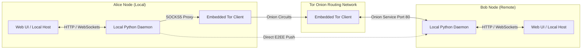

# AnonyMus (Decentralized Peer-to-Peer Architecture)

AnonyMus is a high-security, peer-to-peer (P2P), zero-knowledge messaging application. It relies entirely on Tor Onion Services to establish direct, end-to-end encrypted tunnels between nodes, eliminating the need for centralized servers and preventing IP address leakage.

This branch contains the decentralized version of the application, packaged with a GUI configuration utility disguised as a Windows Network Diagnostics utility.

---

## System Architecture

Instead of routing messages through a central relay, each peer runs a local node that exposes a hidden service (`.onion`) on the Tor network. Outbound messages are posted directly to the recipient's hidden service through a local SOCKS5 Tor proxy.

---

## Repository Structure

- `app_p2p/`: P2P application core modules (server, database, and embedded Tor orchestration).
- `launcher.py`: GUI manager and installer setup disguised as a "Windows Network Diagnostics & Adapter Utility".
- `build.py`: Automation script to compile the launcher into a standalone executable and package it using Inno Setup.
- `setup.iss`: Inno Setup compiler script configuration.

---

## Documentation Index

For detailed instructions and technical descriptions, refer to the following documents:
- [SETUP.md](file:///c:/Users/Aryan/OneDrive/Desktop/Coding%20Projects/1-Custom%20Chat%20App/AnonyMus/SETUP.md): Prerequisites, local manual setup, installer compilation instructions, and unit test execution commands.
- [FEATURES.md](file:///c:/Users/Aryan/OneDrive/Desktop/Coding%20Projects/1-Custom%20Chat%20App/AnonyMus/FEATURES.md): Detailed specifications of the P2P networking protocols, database encryption, GUI camouflage, and secure uninstaller mechanics.
