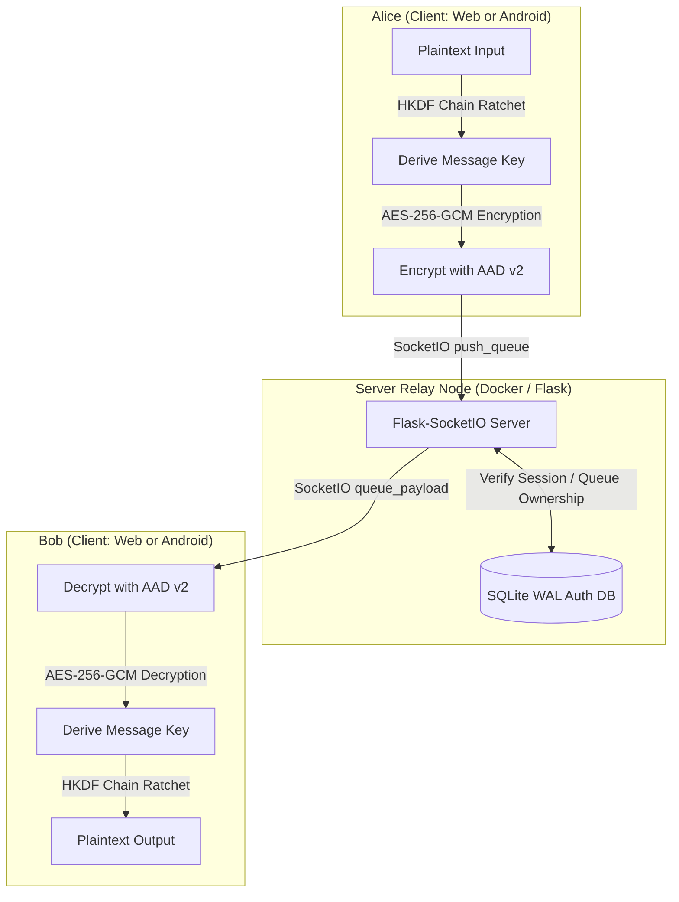

# AnonyMus (Centralized Zero-Knowledge Relay Architecture)

AnonyMus is a secure, end-to-end encrypted (E2EE), zero-knowledge chat application designed with metadata resistance, message forward secrecy, and robust device/web security as its core principles.

This repository contains the complete implementation:
1. **Zero-Knowledge Flask Relay Server** (Python, Flask-SocketIO, SQLite WAL mode, Dockerized)
2. **E2EE Web Client** (HTML5, Vanilla CSS, WebCrypto API)
3. **E2EE Jetpack Compose Android Client** (Kotlin, Google Tink, Biometrics, NSD/Subnet Scan)

---

## Technical Architecture & Security Model

The server acts as a **stateless relay node**—it has zero knowledge of conversation content, rooms, or keys. It does not store or log message payloads. SQLite is utilized strictly to handle user accounts for socket authentication.



### Key Security Implementations

1. **End-to-End Cryptography with Per-Message Forward Secrecy:**
   - **ECDH P-256 Handshake**: Keypairs generated and exchanged out-of-band via secure invite links (or QR codes).
   - **HKDF Chain Key Ratchet**: Prevents compromise of past messages. For each message sent or received, a new message key is derived from the chain key and the chain key is advanced. Message keys are zero-filled immediately after use.
   - **Associated Data Binding (AAD v2)**: Binds ciphertexts to the sorted session fingerprint (Safety Number) and protocol version to prevent replay or packet injection attacks.

2. **Server Hardening & Queue Authorization:**
   - **Queue ID Ownership**: Binds socket connections to queues (`register_peer` / `create_queue` mapping). The server blocks unauthorized users from pushing to queues they do not own.
   - **SQLite WAL Mode**: Configured with Write-Ahead Logging and busy timeouts for concurrent user registrations.
   - **Socket Expiration**: Limits WebSocket connection lifetime to 8 hours max, forcing re-authentication.
   - **Redacting Logger**: Automatically redacts UUIDs and Base64 cryptographic keys from logs.
   - **Secure CORS & Session Flags**: Enforces strict cookie flags (`HttpOnly`, `Secure`, `SameSite=Strict`) and restricts origins.

3. **Synchronized Disappearing Messages:**
   - Peer-negotiated timers (15s, 60s, 5m, 30m) synced automatically using encrypted control frames.
   - Visual countdown indicators with automatic DOM removal and RAM zero-filling on expiry.

4. **Android Client Hardening:**
   - **Google Tink**: Cryptography is backed by the Google Tink library for robust ECDH and AES-GCM execution.
   - **Biometric App Lock**: Integrates Android BiometricPrompt (with strong PIN/Pattern fallbacks) to prevent unauthorized local access.
   - **Anti-Forensics**: Sets `FLAG_SECURE` to block screenshots, video recordings, and task switcher previews.
   - **Cert Pinning (TOFU)**: SHA-256 SPKI fingerprint pinning with a manual reset options screen.

5. **Metadata Resistance via Tor:**
   - Configurable to run as a Tor Hidden Service (`.onion`) to obscure physical server location and client IP addresses.

---

## Project Structure

```
├── AnonyMus_android/      # Kotlin Jetpack Compose Android Client
├── static/                # Web Client JS logic (crypto.js, chat.js, login.js)
├── templates/             # Web Client UI templates (chat.html, login.html)
├── server.py              # Flask-SocketIO Python relay server
├── database.py            # SQLite database manager
├── Dockerfile             # Server deployment container configuration
├── docker-compose.yml     # Multi-container orchestration (Flask + Postgres + Redis)
├── tests/                 # Server, WebCrypto, and Integration test suite
└── README.md              # Project documentation
```

---

## Getting Started

### Prerequisites
- **Python 3.11+**
- **Git**
- **Docker & Docker Compose** (Optional, for containerized run)

### Local Virtualenv Setup

1. **Clone the Repository:**
   ```bash
   git clone https://github.com/aryansinghnagar/AnonyMus.git
   cd AnonyMus
   ```

2. **Setup Environment:**
   - **Windows:**
     ```powershell
     python -m venv venv
     .\venv\Scripts\Activate.ps1
     ```
   - **macOS/Linux:**
     ```bash
     python3 -m venv venv
     source venv/bin/activate
     ```

3. **Install Dependencies:**
   ```bash
   pip install -r requirements.txt
   ```

4. **Configuration:**
   Copy `.env.example` to `.env` and set a secure `FLASK_SECRET_KEY`.

5. **Start Server:**
   ```bash
   python server.py
   ```

### Docker Compose Setup

Run the entire server infrastructure (Flask, PostgreSQL, Redis) with a single command:
```bash
docker-compose up --build
```

---

## Testing

### Running Python Backend & Integration Tests:
```bash
python -m unittest discover tests
```

### Running Android Client Unit Tests:
```bash
cd AnonyMus_android
./gradlew test
```
