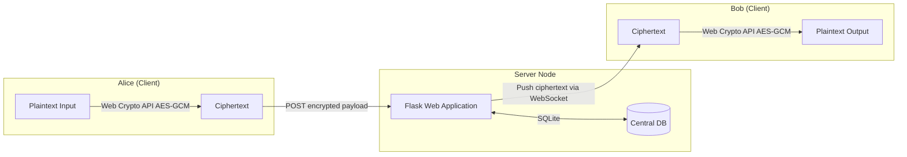

# AnonyMus (Centralized Server Architecture)

AnonyMus is a secure, end-to-end encrypted (E2EE) chat application designed with metadata resistance and web security best practices as its primary guiding principles. 

This branch contains the centralized server implementation, utilizing a Flask-based web server, an SQLite relational database, and native client-side Web Crypto API execution.

---

## Technical Architecture & Security Model

The application ensures that conversation content is never visible to the server or any intermediary network node.



### Key Security Implementations

1. **Client-Side Cryptography (Web Crypto API):**
   - Key generation, cryptographic handshakes, and encryption/decryption are handled entirely in the user's browser.
   - Plaintext messages and private keys never leave the client's device.
   - Symmetric encryption uses AES-GCM (256-bit) to guarantee message confidentiality and integrity.

2. **Server Hardening:**
   - **Session Security:** Cookies are configured with strict flags (`HTTPOnly`, `SameSite=Strict`, `Secure`) to prevent Cross-Site Scripting (XSS) and Cross-Site Request Forgery (CSRF) exploits.
   - **Authentication Integrity:** User logins are protected against timing attacks via a dummy bcrypt check for non-existent users, preventing username enumeration.
   - **Rate Limiting:** Protects registration and login API endpoints from brute-force automated attacks using `Flask-Limiter`.

3. **Metadata Resistance via Tor:**
   - Detailed instructions are provided to host the centralized Flask server as a Tor Hidden Service (`.onion`).
   - This conceals the physical location and IP address of the server, protects client IPs from the server, and allows secure hosting behind NATs without port forwarding.

---

## Getting Started

### Prerequisites

- **Python 3.8+**
- **Git**
- **Virtualenv**

### Installation

1. **Clone the Repository:**
   ```bash
   git clone https://github.com/aryansinghnagar/AnonyMus.git
   cd AnonyMus
   ```

2. **Create and Activate a Virtual Environment:**
   - **Windows:**
     ```powershell
     python -m venv venv
     .\venv\Scripts\Activate.ps1
     ```
   - **macOS/Linux:**
     ```bash
     python3 -m venv venv
     source venv/bin/activate
     ```

3. **Install Dependencies:**
   ```bash
   pip install -r requirements.txt
   ```

### Running the Server

Start the centralized Flask server:
```bash
python server.py
```

By default, the server runs locally at `http://127.0.0.1:5000`. 

---

## Hosting as a Tor Hidden Service

To achieve true server anonymity and metadata resistance:

1. **Install Tor:**
   - **Debian/Ubuntu:** `sudo apt install tor`
   - **macOS:** `brew install tor`
   - **Windows:** Download the **Tor Expert Bundle** or **Tor Browser** from [torproject.org](https://www.torproject.org/).

2. **Configure Tor Service (`torrc`):**
   Append the configuration to your `torrc` file:

   **For Linux / macOS:**
   ```text
   HiddenServiceDir /var/lib/tor/anonymus_hidden_service/
   HiddenServicePort 80 127.0.0.1:5000
   ```

   **For Windows:**
   ```text
   HiddenServiceDir C:/Users/Public/anonymus_hidden_service/
   HiddenServicePort 80 127.0.0.1:5000
   ```
   *(Note: For step-by-step guidance on locating `torrc` and retrieving the generated `.onion` address, see [SETUP.md](file:///c:/Users/Aryan/OneDrive/Desktop/Coding%20Projects/1-Custom%20Chat%20App/AnonyMus/SETUP.md) or [tor_setup.md](file:///c:/Users/Aryan/OneDrive/Desktop/Coding%20Projects/1-Custom%20Chat%20App/AnonyMus/tor_setup.md)).*
