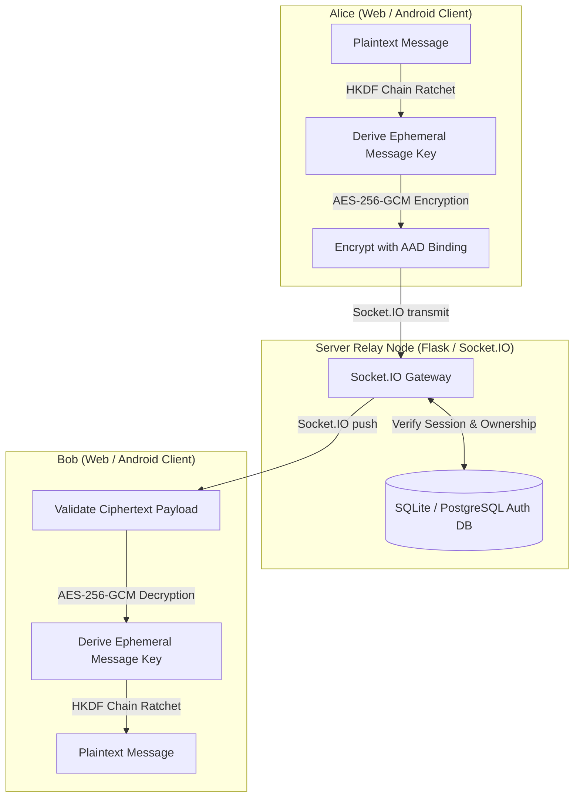
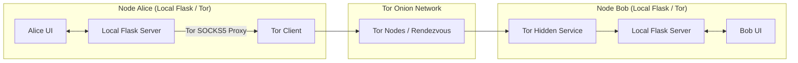

# AnonyMus (Unified Architecture)

AnonyMus is a high-security, end-to-end encrypted (E2EE), metadata-resistant messaging application designed with zero-knowledge relay architecture, peer-to-peer (P2P) onion routing over the Tor network, message forward secrecy, and robust client-side sandboxing.

This repository consolidates the centralized server-client architecture and the decentralized peer-to-peer architecture into a single, unified codebase. Users can switch between standard centralized relay mode and decentralized P2P mode dynamically at runtime or via configurations.

---

## System Architecture

The application operates in one of two modes:
1. **Centralized Relay Mode**: The server acts as a stateless, ephemeral message queue relay. It maintains no persistent records of chat messages, room histories, or cryptographic keys. SQLite or PostgreSQL is used solely for user authentication and session validation.
2. **Decentralized P2P Mode**: Peer nodes communicate directly over Tor onion hidden services. Outbound traffic is routed through Tor's SOCKS5 proxy to anonymize metadata, ensuring no peer ever exposes their true IP address to another. Local databases are encrypted at rest using AES-256-GCM.

### Centralized Relay Mode Flow

### Decentralized P2P Mode Flow

---

## Repository Structure

- [core/](file:///c:/Users/Aryan/OneDrive/Desktop/Coding%20Projects/1-Custom%20Chat%20App/AnonyMus/core): Mode-agnostic system primitives, including cryptographic services, identity helpers, session/ratchet state managers, redacting logger, and shared interfaces.
- [transports/](file:///c:/Users/Aryan/OneDrive/Desktop/Coding%20Projects/1-Custom%20Chat%20App/AnonyMus/transports):
  - [relay/](file:///c:/Users/Aryan/OneDrive/Desktop/Coding%20Projects/1-Custom%20Chat%20App/AnonyMus/transports/relay): Standard centralized relay server, SQLite/PostgreSQL auth database wrappers, and mode adapter.
  - [p2p/](file:///c:/Users/Aryan/OneDrive/Desktop/Coding%20Projects/1-Custom%20Chat%20App/AnonyMus/transports/p2p): Decentralized peer node, AES-GCM local database, Tor Expert Bundle manager, contact list manager, and mode adapter.
- [web/](file:///c:/Users/Aryan/OneDrive/Desktop/Coding%20Projects/1-Custom%20Chat%20App/AnonyMus/web): Mode-aware client web application containing static assets and HTML templates.
- [android/](file:///c:/Users/Aryan/OneDrive/Desktop/Coding%20Projects/1-Custom%20Chat%20App/AnonyMus/android): Native Android client written in Kotlin using Jetpack Compose and Google Tink.
- [launcher/](file:///c:/Users/Aryan/OneDrive/Desktop/Coding%20Projects/1-Custom%20Chat%20App/AnonyMus/launcher): Multi-mode GUI launcher disguised as "Windows Network Diagnostics & Adapter Utility" with PyInstaller & Inno Setup scripts.
- [tests/](file:///c:/Users/Aryan/OneDrive/Desktop/Coding%20Projects/1-Custom%20Chat%20App/AnonyMus/tests): Unified unit and integration test suite discoverable under the tests directory.
- [server.py](file:///c:/Users/Aryan/OneDrive/Desktop/Coding%20Projects/1-Custom%20Chat%20App/AnonyMus/server.py): Root WSGI Dispatcher routing traffic to the active transport mode dynamically.

---

## Documentation Index

For detailed instructions and descriptions, refer to the following documents in the `docs` folder:
- [SETUP.md](file:///c:/Users/Aryan/OneDrive/Desktop/Coding%20Projects/1-Custom%20Chat%20App/AnonyMus/docs/SETUP.md): System prerequisites, environment configuration, mode orchestration, database migrations, and step-by-step deployment guide.
- [FEATURES.md](file:///c:/Users/Aryan/OneDrive/Desktop/Coding%20Projects/1-Custom%20Chat%20App/AnonyMus/docs/FEATURES.md): Functional specification, cryptographic protocol analysis, threat model, Tor network routing details, and client hardening mechanisms.
