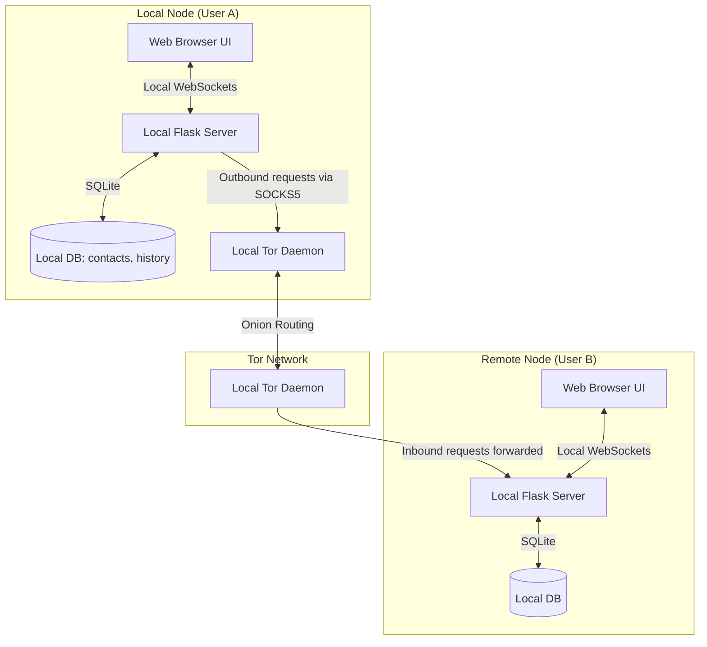

# AnonyMus P2P (Decentralized Tor-Embedded Chat Node)

AnonyMus P2P is a serverless, zero-metadata, peer-to-peer (P2P) chat application that routes all communications directly over the Tor network. By utilizing Tor Onion Services, AnonyMus P2P eliminates the need for centralized message brokers, directories, or servers, providing ultimate metadata resistance, server anonymity, and client anonymity out of the box.

---

## Technical Architecture & Design

Unlike traditional chat systems, each user runs their own local node, which functions as both a client and a hidden server.

### Key Components



1. **Embedded Tor Wrapper (`tor_manager.py`):**
   - Automatically downloads, extracts, and manages the official **Tor Expert Bundle** binary suitable for the host operating system (Windows, macOS, Linux).
   - Starts a background Tor process with a dynamically assigned control port and SOCKS5 proxy port (default: `9050`).
   - Configures and provisions a dedicated Tor Onion Service (generating a unique `.onion` address) pointing to the local Flask application.

2. **Flask Control Panel & P2P API (`server.py`):**
   - Serves the chat web interface on a loopback address (`127.0.0.1`) for local user interaction.
   - Implements a strict security middleware filter (`restrict_access`) that blocks external users from accessing the control panel/UI over Tor, exposing only `/p2p/*` endpoints to the public Tor network.

3. **End-to-End Encryption (E2EE) & Key Exchange:**
   - **Handshake Protocol:** When adding a contact, nodes exchange ephemeral Elliptic-Curve Diffie-Hellman (ECDH) public keys over Tor.
   - **Key Derivation:** Nodes derive a shared secret using the ECDH keys combined with a salt via HKDF.
   - **Symmetric Encryption:** All subsequent chat messages are encrypted client-side using AES-GCM (256-bit) with a unique initialization vector (IV) and sequence number. The plaintext is never transmitted or saved in unencrypted form.

4. **Local SQLite Storage (`database.py`):**
   - All settings, contacts, public keys, shared secrets, and encrypted chat messages are saved in a local, single-file SQLite database (`users.db`).

---

## Features

- **No Central Servers:** Zero central authority, zero tracker servers, and no directory registers. Communication is strictly peer-to-peer.
- **NAT Traversal:** Works behind strict firewalls and NATs without port forwarding.
- **Double Anonymity:** Neither sender nor receiver learns the other's real IP address or physical location.
- **Perfect Forward Secrecy support:** Uses modern browser Web Crypto APIs for cryptographic operations.
- **Security Protections:** Hardened cookie scopes, rate limiting, and timing-attack countermeasures for local client authentication.

---

## Getting Started

### Prerequisites

- **Python 3.8+**
- **Git**
- Web browser (Chrome, Firefox, Safari, Edge, etc.)

> [!NOTE]
> You do **not** need to pre-install Tor. The application automatically downloads and runs an isolated Tor binary within the project directory.

### Installation

1. **Clone the Repository:**
   ```bash
   git clone https://github.com/aryansinghnagar/AnonyMus.git
   cd AnonyMus
   ```

2. **Create and Activate a Virtual Environment:**
   - **Windows:**
     ```powershell
     python -m venv venv
     .\venv\Scripts\Activate.ps1
     ```
   - **macOS/Linux:**
     ```bash
     python3 -m venv venv
     source venv/bin/activate
     ```

3. **Install Dependencies:**
   ```bash
   pip install -r requirements.txt
   ```

### Running the Node

Start the chat node by running the Flask server:
```bash
python server.py
```

On start, the application will:
1. Download and set up the Tor Expert Bundle if not present.
2. Initialize the local SQLite database (`users.db`).
3. Boot the local Tor daemon and retrieve/generate your node's unique `.onion` address.
4. Output the local control panel address (e.g., `http://127.0.0.1:8080`).

Open the printed URL in your browser to access the control panel, register your local master password (to unlock the database), and start chatting!

---

## How to Chat (P2P Walkthrough)

1. **Initialize:** When opening the web UI for the first time, set a local username and master password.
2. **Find Your Onion Address:** Click on the profile section in the web UI to copy your unique `.onion` address.
3. **Add a Contact:** Share your `.onion` address with a friend. Paste their `.onion` address into the "Add Contact" field, enter a nickname, and send a contact request.
4. **Accept Handshake:** When your friend receives your request, they will see a pending connection. Accepting the request initiates the ECDH cryptographic handshake, derives the AES-GCM shared key, and establishes a secure channel.
5. **Chat securely:** All messages sent are now encrypted client-side in the browser and dispatched directly through Tor.
