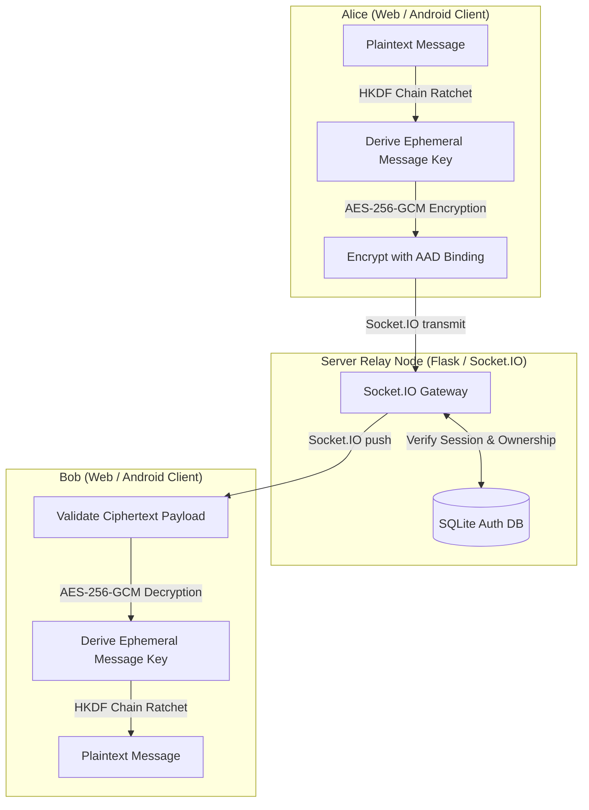

# AnonyMus (Centralized Relay Architecture)

AnonyMus is a high-security, end-to-end encrypted (E2EE), metadata-resistant messaging application designed with zero-knowledge relay architecture, message forward secrecy, and robust client-side sandboxing.

This branch contains the centralized server-client architecture, consisting of a zero-knowledge Flask relay server, a lightweight web client, and an Android client.

---

## System Architecture

The server acts as a stateless message queue relay. It maintains no persistent records of chat messages, room histories, or cryptographic keys. The database is utilized solely for user authentication and session validation.

---

## Repository Structure

- `AnonyMus_android/`: Native Android client written in Kotlin using Jetpack Compose and Google Tink.
- `static/`: Web client assets including E2EE cryptographic and WebSocket event handlers.
- `templates/`: HTML structures for client authentication and the chat dashboard.
- `server.py`: Flask-SocketIO server implementation utilizing eventlet asynchronous workers.
- `database.py`: SQLite wrapper supporting Write-Ahead Logging (WAL) and concurrent operations.
- `Dockerfile`: Production deployment configuration.
- `docker-compose.yml`: Container orchestration (Flask + optional PostgreSQL + Redis).
- `tests/`: Automated unit and integration test suites.

---

## Documentation Index

For detailed instructions and descriptions, refer to the following documents:
- [SETUP.md](file:///c:/Users/Aryan/OneDrive/Desktop/Coding%20Projects/1-Custom%20Chat%20App/AnonyMus/SETUP.md): System prerequisites, environment configuration, database migrations, and step-by-step deployment guide.
- [FEATURES.md](file:///c:/Users/Aryan/OneDrive/Desktop/Coding%20Projects/1-Custom%20Chat%20App/AnonyMus/FEATURES.md): Functional specification, cryptographic protocol analysis, threat model, and client hardening details.
