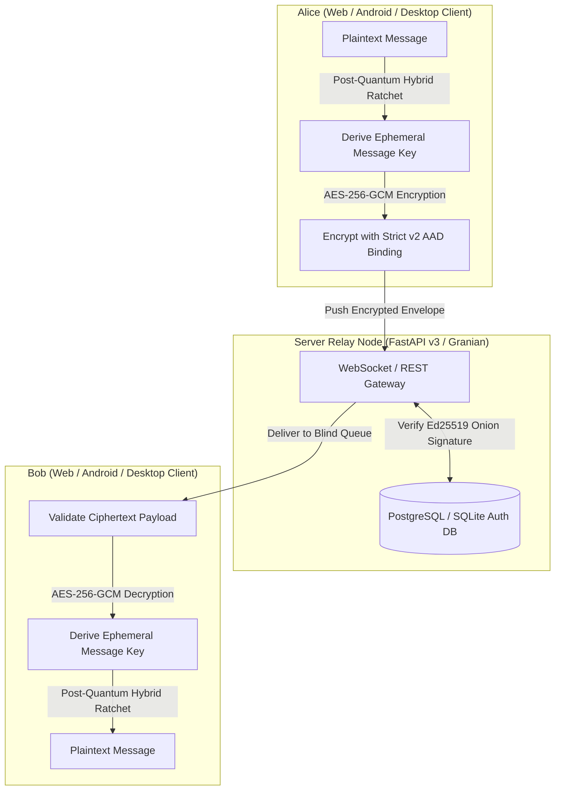
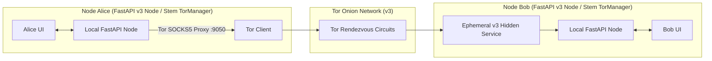

# AnonyMus (Unified Architecture v3.0)

AnonyMus is a high-security, end-to-end encrypted (E2EE), metadata-resistant messaging application engineered with a zero-knowledge relay architecture, decentralized peer-to-peer (P2P) onion routing over Tor v3 hidden services, post-quantum hybrid forward secrecy, and robust client-side sandboxing.

The codebase consolidates both the stateless relay architecture and the decentralized peer-to-peer architecture into a single unified repository running on an asynchronous **FastAPI v3 ASGI engine**.

---

## System Architecture

The application operates in one of two modes:
1. **Centralized Relay Mode**: The server acts as a stateless, ephemeral message queue relay. It maintains no persistent records of chat messages, room histories, or cryptographic keys. SQLite or PostgreSQL is used solely for node registration and challenge-response authentication.
2. **Decentralized P2P Mode**: Peer nodes communicate directly over ephemeral Tor v3 onion hidden services. Outbound traffic is routed through Tor's SOCKS5 proxy to anonymize metadata, ensuring no peer ever exposes their true IP address. Local databases are encrypted at rest using SQLCipher (AES-256-GCM) with Argon2id key derivation.

### Centralized Relay Mode Flow

### Decentralized P2P Mode Flow

---

## Repository Structure

- [core/](file:///c:/Users/Aryan/OneDrive/Desktop/Coding%20Projects/1-Custom%20Chat%20App/AnonyMus/core): Mode-agnostic system primitives:
  - [crypto.py](file:///c:/Users/Aryan/OneDrive/Desktop/Coding%20Projects/1-Custom%20Chat%20App/AnonyMus/core/crypto.py): Argon2id/PBKDF2 key derivation, Ed25519 signatures, X25519 ECDH, AES-256-GCM AEAD.
  - [double_ratchet.py](file:///c:/Users/Aryan/OneDrive/Desktop/Coding%20Projects/1-Custom%20Chat%20App/AnonyMus/core/double_ratchet.py): Post-Quantum Hybrid Double Ratchet implementation with ML-KEM-768 encapsulation.
  - [prekey_pool.py](file:///c:/Users/Aryan/OneDrive/Desktop/Coding%20Projects/1-Custom%20Chat%20App/AnonyMus/core/prekey_pool.py): Automatic prekey pool tracking and replenishment background worker.
  - [protocol.py](file:///c:/Users/Aryan/OneDrive/Desktop/Coding%20Projects/1-Custom%20Chat%20App/AnonyMus/core/protocol.py): Unbiased rejection-sampling safety numbers (`ANO-CODE-009`) and strict v2 AAD decryption (`ANO-SEC-017`).
  - [tor_daemon.py](file:///c:/Users/Aryan/OneDrive/Desktop/Coding%20Projects/1-Custom%20Chat%20App/AnonyMus/core/tor_daemon.py): Stem-based Tor Control Port client managing ephemeral v3 hidden services.
  - [rust/](file:///c:/Users/Aryan/OneDrive/Desktop/Coding%20Projects/1-Custom%20Chat%20App/AnonyMus/core/rust): Native Rust cryptographic core (`anonymus_core`) containing TreeKEM MLS, Double Ratchet, and padding engines.
- [transports/](file:///c:/Users/Aryan/OneDrive/Desktop/Coding%20Projects/1-Custom%20Chat%20App/AnonyMus/transports):
  - [p2p/](file:///c:/Users/Aryan/OneDrive/Desktop/Coding%20Projects/1-Custom%20Chat%20App/AnonyMus/transports/p2p): P2P FastAPI v3 application, modular routers (`/v3/auth`, `/v3/messages`, `/v3/files`, `/v3/keys`, `/v3/sync`, `/v3/node`), and `TorManager`.
  - [relay/](file:///c:/Users/Aryan/OneDrive/Desktop/Coding%20Projects/1-Custom%20Chat%20App/AnonyMus/transports/relay): Blind relay FastAPI v3 server with Ed25519 node verification and Redis ephemeral buffering.
- [web/](file:///c:/Users/Aryan/OneDrive/Desktop/Coding%20Projects/1-Custom%20Chat%20App/AnonyMus/web): SolidJS + Vite + TypeScript PWA web client with reactive message stores and Tailwind styling.
- [android/](file:///c:/Users/Aryan/OneDrive/Desktop/Coding%20Projects/1-Custom%20Chat%20App/AnonyMus/android): Native Android client written in Kotlin using Jetpack Compose and Google Tink.
- [ios/](file:///c:/Users/Aryan/OneDrive/Desktop/Coding%20Projects/1-Custom%20Chat%20App/AnonyMus/ios): Native iOS client scaffold written in Swift with SwiftUI.
- [launcher/](file:///c:/Users/Aryan/OneDrive/Desktop/Coding%20Projects/1-Custom%20Chat%20App/AnonyMus/launcher): Local service launcher GUI and Inno Setup Windows installer scripts.
- [tests/](file:///c:/Users/Aryan/OneDrive/Desktop/Coding%20Projects/1-Custom%20Chat%20App/AnonyMus/tests): Unified unit, integration, and KAT test suite.
- [server.py](file:///c:/Users/Aryan/OneDrive/Desktop/Coding%20Projects/1-Custom%20Chat%20App/AnonyMus/server.py): ASGI entry point dispatching requests to P2P or Relay mode dynamically.

---

## Documentation Index

- [Setup & Deployment Guide](guides/setup.md): System prerequisites, environment setup, and deployment options.
- [Self-Hosting Guide](guides/self-hosting.md): Run your own blind relay with Docker Compose and Caddy auto-TLS.
- [Cryptographic Specifications](protocols/crypto-spec.md): In-depth analysis of PQ-KEM, Double Ratchet, safety numbers, and envelope formats.
- [Multi-Device Sync](protocols/multi-device-sync.md): Specification for mutual 256-bit token authenticated LAN pairing.
- [Security Policy & Threat Model](SECURITY.md): Threat vectors, mitigations, and vulnerability disclosure policy.
- [Audit Remediation Log](AUDIT_REMEDIATION.md): Forensic audit logs and mitigations for findings ANO-SEC-001 through ANO-SEC-024.
- [Request for Comments (RFCs)](rfcs/index.md): Design proposals and specifications (RFC 0000 through RFC 0016).
