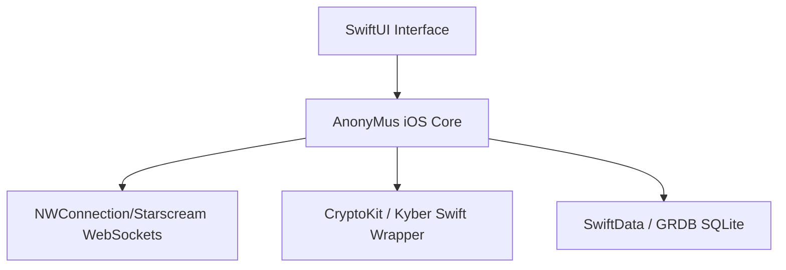
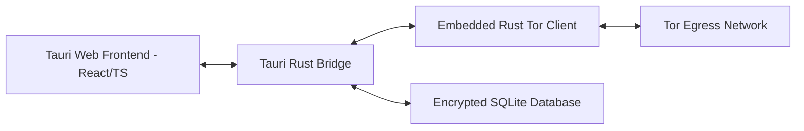
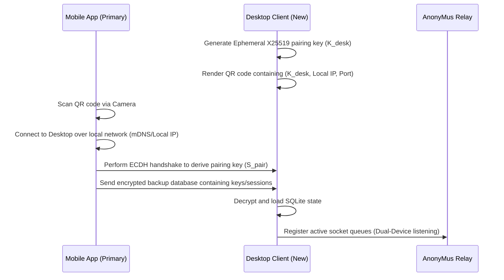

# RFC 0011 — Post-1.0 Roadmap & Implementation Guide

This RFC outlines the technical architecture, sequence flows, and implementation guides for the three planned post-1.0 features of the AnonyMus secure messaging network.

---

## 1. Swift iOS Client (10.J.1)

### Technical Architecture
The iOS client will be a native Swift app utilizing SwiftUI for the UI layer and binding to the core cryptographic primitives.

### Key Modules
1. **Cryptographic Core:**
   * **ECDH & HKDF:** Use Apple's native `CryptoKit` framework for X25519 DH operations and HKDF derivation.
   * **Kyber KEM:** Bind a Swift port of Kyber-768 (or bridge a lightweight Rust library using Swift Package Manager's binary targets).
   * **Double Ratchet:** Implement the ratchet state machine in Swift, mirroring the Kotlin and TypeScript session serializers.
2. **Storage Layer:** Use `GRDB.swift` or `SwiftData` to store contacts, messages, and ratchet states in an encrypted SQLite container utilizing iOS File Protection (`completeFileProtection`).
3. **Tor Routing:** Bundle the `Tor.framework` library to manage an embedded Tor daemon instance on iOS, exposing a local SOCKS5 proxy.

---

## 2. Desktop Client (10.J.2)

### Technical Architecture
To optimize performance, security, and developer velocity, we recommend utilizing **Tauri** over Electron. Tauri compiles to a native Rust binary, uses the system's native Webview (Webkit/WebView2), and has a significantly smaller memory footprint.

### Key Modules
1. **Frontend Assets:** Reuse the compiled `@anonymus/client` TypeScript SDK inside a React/TypeScript web app.
2. **System Tray Integration:** Implement system tray notifications, minimize-to-tray behaviors, and launch-on-boot configurations using Tauri's native `SystemTray` API.
3. **Encrypted Local Storage:** Use SQLCipher via Tauri's Rust backend to isolate and encrypt chat message history.

---

## 3. Mobile ↔ Desktop Syncing (10.I.1)

### Technical Architecture
AnonyMus uses pairwise pseudonymous queues. To prevent race conditions and synchronize E2EE messages across multiple devices, we propose an **Ephemeral Device Pairing & Database Sync** model.

### Step-by-Step Implementation Guide
1. **QR Pairing Exchange:** The desktop client starts a temporary local WebSocket server and displays a QR code containing its local IP address, port, and public key.
2. **Local Sync Broker:** The mobile client scans the QR code, initiates a secure WebSocket connection over the local network, and performs a Diffie-Hellman handshake.
3. **Encrypted DB Handoff:** The mobile client packs its local database (excluding profile passphrases), encrypts it with the derived handshake key, and sends it to the desktop.
4. **Relay Socket Sync:** Both devices connect to the same pairwise queue IDs. The relay sends incoming envelopes to both connected sockets, allowing real-time message sync.
