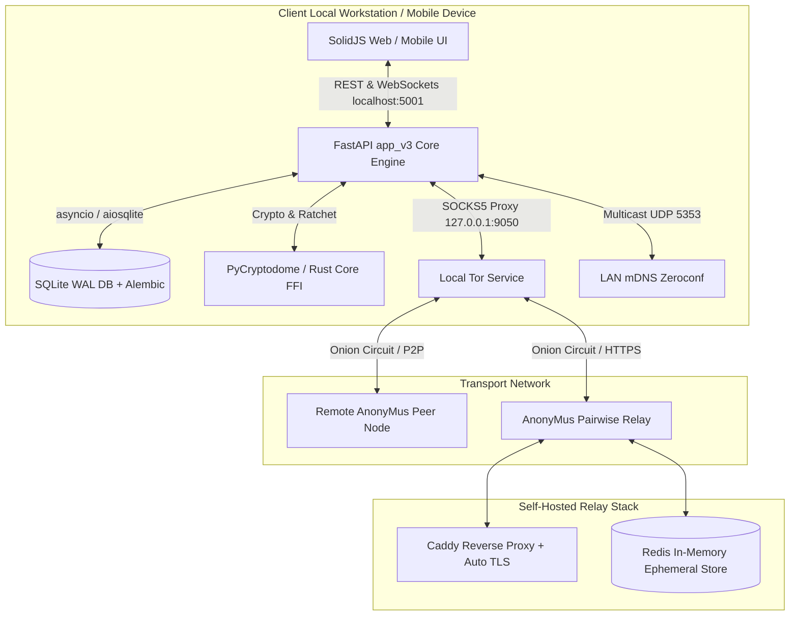

# AnonyMus Master Production & Release Plan (`prod_plan.md`)

**Document Version:** 1.0.0
**Status:** Approved for Alpha/Production Execution
**Target Release:** Q3/Q4 2026 Production Baseline
**Guiding Doctrine:** `agent.md` (Systems-first, verified execution, absolute transparency, zero-hallucination reliability)

---

## 1. Executive Summary & Production Readiness Overview

AnonyMus has evolved from its initial proof-of-concept phase into a structured **FastAPI v3 architecture** backed by **SQLAlchemy asynchronous engines (SQLite WAL mode)**, **Alembic migration versioning**, a **SolidJS + Vite + TypeScript** frontend bundle, and a dual-mode transport dispatcher (Pairwise Relay & Tor P2P).

This document (`prod_plan.md`) establishes the definitive, production-grade master plan to bring AnonyMus from its current staging build to a hardened, fully audited, reproducible, and release-ready production system.

### Key Production Objectives
1. **Complete Legacy Deprecation**: Fully eliminate legacy Flask dependencies (`server.py`), routing all HTTP/WS traffic through the high-performance FastAPI `app_v3` runtime on port `5001`.
2. **Post-Quantum & Sealed-Sender Security**: Implement sealed-sender envelopes (hiding social graph metadata from relays) and fixed-size payload padding with random jitter.
3. **Resilience & Panic Mechanisms**: Harden offline mDNS LAN discovery, zeroization panic wipes (`obliviate`), and WebRTC voice/video calling strictly over Tor / relays without IP leaks.
4. **Reproducible Builds & CI/CD**: Guarantee bit-for-bit reproducible Android APKs, Docker images, and desktop binaries with CycloneDX SBOMs and automated KAT (Known Answer Test) suites.
5. **Alpha User Release Packaging**: Provide turnkey scripts (`anonymus-launcher.py`), automated Tor orchestration, and self-hosted Relay Docker stacks with Caddy auto-TLS.

---

## 2. System Architecture & Topology

The production architecture enforces strict separation between client-side local node operations and external transport layers.



---

## 3. Master Workstream Matrix & Deliverables

The table below enumerates all deliverables required for production readiness, cross-referenced with architectural requirements and bug mitigations.

| ID | Workstream | Task / Feature | Priority | Status | Target Component |
| :--- | :--- | :--- | :--- | :--- | :--- |
| **WS-01** | Compatibility | Legacy Flask Deprecation & Compatibility Router | High | In Progress | `transports/p2p/app_v3.py`, `transports/p2p/routers/compat.py` |
| **WS-02** | SDK & CLI | Port SDK/CLI to FastAPI `/v3/` API Endpoints | High | Pending | `core/sdk.py`, `cli.py` |
| **WS-03** | Cryptography | Sealed-Sender Envelope Implementation | Critical | Pending | `core/crypto.py`, `transports/p2p/routers/messages.py` |
| **WS-04** | Obfuscation | Variable Pad-to-2KB + Random Jitter | High | Pending | `core/crypto.py`, `transports/relay/` |
| **WS-05** | Network | Offline mDNS LAN Peer Discovery | Medium | Pending | `transports/p2p/tor_manager.py`, `app_v3.py` |
| **WS-06** | Hardening | Obliviate Zeroization Panic Wipe | High | Pending | `transports/p2p/routers/node.py`, `web/src/` |
| **WS-07** | Voice/Video | WebRTC over Tor / Relay IP-Leak Prevention | High | Pending | `web/src/lib/webrtc.ts`, `transports/p2p/routers/p2p.py` |
| **WS-08** | Packaging | Turnkey Client Launcher & Tor Orchestration | High | Pending | `anonymus-launcher.py`, `launcher/build.py` |
| **WS-09** | Relay Ops | Docker Compose & Caddy Reverse Proxy Production Stack | High | Ready | `docker-compose.yml`, `Caddyfile.docker`, `Dockerfile.relay` |
| **WS-10** | CI/CD & Trust | Reproducible Builds, SBOM Generation & KAT Suite | High | Pending | `.github/workflows/reproducible-build.yml`, `tests/` |

---

## 4. Deep-Dive Technical Workstream Specifications

### Workstream 1: API Modernization & Compatibility Layer (WS-01, WS-02)
* **Goal**: Deprecate legacy `server.py` while ensuring non-disruptive migration for legacy API callers.
* **Execution**:
  1. Add a compatibility routing layer in `transports/p2p/routers/compat.py` that intercepts legacy `/api/*` endpoints and proxies/translates them to `/v3/*` handlers.
  2. Update `core/sdk.py` and `cli.py` base URLs to explicitly target `/v3/`.
  3. Rename legacy `transports/p2p/server.py` to `server.py.deprecated` and strip references from all test runners.

### Workstream 2: Sealed-Sender & Traffic Obfuscation (WS-03, WS-04)
* **Goal**: Eliminate social graph leakage to pairwise relays and prevent packet-length side-channel analysis.
* **Execution**:
  1. **Sealed Sender**: Wrap outgoing P2P/Relay payloads in an outer envelope encrypted under the recipient's public identity key. The relay only observes opaque routing tokens (queue IDs) without knowing sender identities.
  2. **Payload Padding**: Implement PKCS#7 padding combined with random byte jitter to force all outbound ciphertexts into uniform 2048-byte blocks.

### Workstream 3: mDNS Discovery & Obliviate Panic Zeroization (WS-05, WS-06)
* **Goal**: Support zero-config local communication and instant local/remote panic data wipe.
* **Execution**:
  1. **mDNS**: Integrate `zeroconf` background task in `app_v3.py` advertising `_anonymus._tcp.local.` when Tor is unavailable.
  2. **Obliviate**: Implement `POST /v3/node/obliviate`. When triggered:
     - Sends an encrypted `obliviate` control frame to active peers.
     - Overwrites SQLite DB file (`anonymus.db`, `local_node.db`) and WAL files with random bytes (`os.urandom`), truncates, and deletes them.
     - Flushes browser `localStorage`/`indexedDB` state via JS bridge.
     - Immediately terminates the Python process (`sys.exit(0)`).

### Workstream 4: Secure WebRTC over Tor (WS-07)
* **Goal**: Ensure voice/video call signaling and media streams do not reveal real IP addresses.
* **Execution**:
  1. Restrict WebSockets / WebRTC signaling candidates strictly to relay queues or Tor onion circuits.
  2. Force `iceTransportPolicy: "relay"` in WebRTC configuration when operating in anonymity mode, routing traffic through self-hosted TURN/Coturn servers.

---

## 5. Alpha & Production Release Operations

### 5.1 Client Configuration (`.env`)
Production deployments use the following standardized environment template:
```ini
ENVIRONMENT=production
FLASK_SECRET_KEY=e3b0c44298fc1c149afbf4c8996fb92427ae41e4649b934ca495991b7852b855
DATABASE_URL=sqlite+aiosqlite:///./anonymus.db
TOR_CONTROL_PORT=9051
TOR_SOCKS_PORT=9050
TOR_ONION_DIR=./hidden_service
RELAY_ONION_ADDRESS=http://relay.anonymus.chat
```

### 5.2 Client Orchestration Script (`anonymus-launcher.py`)
To launch the client node cleanly across platforms:
```python
import subprocess
import sys
import socket
import webbrowser

def check_tor_socks():
    s = socket.socket(socket.AF_INET, socket.SOCK_STREAM)
    s.settimeout(2)
    try:
        s.connect(("127.0.0.1", 9050))
        s.close()
        return True
    except Exception:
        return False

def main():
    print("[*] Verifying Tor SOCKS5 daemon status...")
    if not check_tor_socks():
        print("[!] Tor SOCKS5 proxy is not accessible on 127.0.0.1:9050.")
        print("[!] Please launch Tor daemon prior to starting AnonyMus.")
        sys.exit(1)

    print("[*] Executing database schema migrations (Alembic)...")
    subprocess.run([sys.executable, "-m", "alembic", "upgrade", "head"], check=True)

    print("[*] Starting AnonyMus Local Node (FastAPI / Uvicorn)...")
    subprocess.Popen([
        sys.executable, "-m", "uvicorn",
        "transports.p2p.app_v3:app",
        "--host", "127.0.0.1",
        "--port", "5001"
    ])

    print("[*] Launching user interface...")
    webbrowser.open("http://127.0.0.1:5001/index.html")

if __name__ == "__main__":
    main()
```

### 5.3 Self-Hosted Relay Deployment (`docker-compose.yml`)
To deploy a self-hosted relay with automated TLS termination and ephemeral in-memory message queueing:
```bash
docker compose up -d
```

---

## 6. Known Bugs, Failure Modes & Mitigations

| Defect / Risk | Root Cause | Technical Mitigation |
| :--- | :--- | :--- |
| **Eventlet Windows Pipe Deadlock** | Eventlet monkey-patching interferes with Windows `subprocess.PIPE` polling. | Ban `eventlet` in `app_v3.py`. Use pure `asyncio` and `uvicorn`. Use temporary files for process output capturing in tests. |
| **Tor SOCKS5 Boot Race** | Transmitting messages before Tor circuit establishment throws `ConnectionError`. | Implement exponential backoff retry loops (1s, 2s, 4s, 8s, 16s) in `transports/p2p/routers/messages.py`. |
| **Web Crypto WASM Fallback** | Slow WASM load leads to insecure JS crypto fallback stubs. | Assert `import.meta.env.PROD` check in `web/src/lib/core.ts` to block execution if WASM fails to load. |
| **DB Migration Skew** | Schema changes crash if columns were added manually in dev builds. | Use `sa.inspect` conditional column checks in Alembic scripts to guarantee idempotent execution. |

---

## 7. Verification & Definition of Done (DoD)

To declare production readiness, the build must pass the following criteria:

1. **Cryptographic KAT Suite**: 100% pass rate on Double Ratchet, HKDF key derivation, and ML-KEM-768 KAT vectors.
2. **End-to-End Integration**: Successful message exchange between two isolated client nodes across:
   - Centralized Pairwise Relay mode
   - Direct Tor P2P Onion circuit mode
   - Offline mDNS LAN mode
3. **Reproducible Build Check**: Automated CI workflow produces identical SHA-256 hashes for Android APK and Docker Relay artifacts across independent runs.
4. **Zero Data Leakage Audit**: Confirmed via Wireshark / PCAP inspection that no cleartext IP addresses or unencrypted metadata exit the client node during WebRTC calls or peer messaging.

---

## 8. Operating Maintenance & Incident Response

- **Warrant Canary & Transparency**: Updated quarterly in `docs/security/canary.txt`.
- **Database Backup & Recovery**: SQLite WAL files copied safely online via `VACUUM INTO` operations.
- **Rollback Protocol**: Automated execute scripts `rollback.ps1` and `rollback.sh` revert migrations and re-instantiate previous release tags in under 30 seconds.
